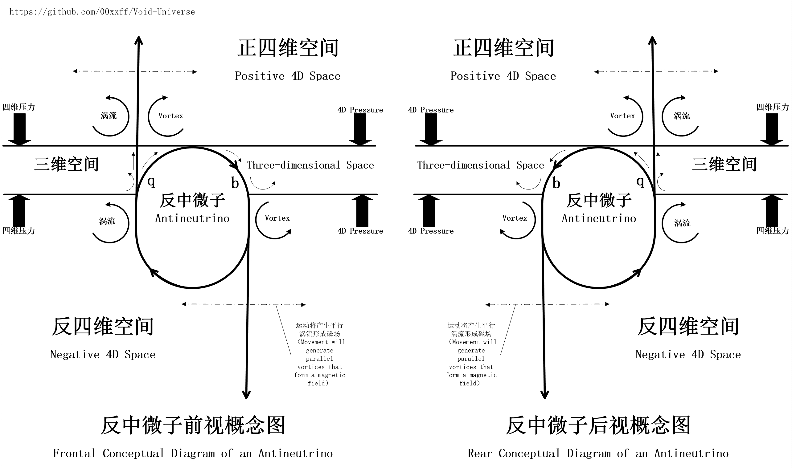

# 中文 | [English](en/README.md)

### 前言

本模型是一个能够对已知的所有物理现象完成统一解释的**模拟**框架。
通过两种基本粒子A和B，在一个四维坐标系里组成动态稳定的系统，实现了对各种基础物理现象的直观描述。

*虚空宇宙假说：在一个充满混乱的A粒子和大量B粒子的四维空间，偶然形成了一个w轴上A粒子流体压力平衡的三维夹层（三维膜），然后越来越多的B粒子撞上了这个三维膜并分别依附在这个三维膜的两侧，由于B粒子的特性（高周波振动）驱动了单侧的A粒子流，它们给这个三维膜带来了更稳定的平衡条件，最终一个宇宙在此诞生。
其中，A粒子的三维形态是“以太”，B粒子的三维形态是“中微子”，为了在四维空间中描述它们，我们对它们的四维形态重新命名为“虚空粒子”和“虚粒子”。*

该模型原理通俗易懂，可以轻松解释许多之前难以理解的宇宙、量子及物理现象。模型框架内的各种作用机制均可以用现有的理论和数学工具完成推导和验证。
在这个模型中，你会发现：

* 万有引力其实是压力导致的；
* 电磁力的根源是瞬态涡流体形成的局部压力；
* 光子是一种四维界面波，在三维界面中的我们看来就像一个跳跃性前进的粒子；
* 在相对论中，时间膨胀实际上只是因为部分物理现象变慢了；
* 空间是真的在膨胀；

> 2024年10月30日，模型推导最新重大发现
> 物质的虚空球体相互作用机制在大尺度的天文现象上与万有引力的表述不一致，在修改推导过程中却发现了虚空压力理论在天文大尺度上的表现与天文学观测到的现象一致，如果这点可以得到充分论证，这意味着虚空压力理论可以直接描述天文大尺度上的现象，而不需要引入暗物质，这将成为奠定这个大统一理论成立的基石。

> 旋转曲线问题 和 系团的动力学问题 的表现 与 质量系统的虚空球同步旋转 的特征表现一致。
> 宇宙的大尺度网络结构 与 宇宙大尺度上局部积聚的虚空压力泡把星系团都推到一起的特征表现一致。
> 如果这些都符合数学推导的话“暗物质”可能就不复存在了。
> 详情请查看 [万有引力与虚空压力](虚空宇宙模型及推理/万有引力与虚空压力.md)

**备注：模型中的“命运齿轮”都是对一种核心粒子的代称，之所以这个名字，是因为在这个模型中宇宙因它而存在，它代表着宇宙万物的命运。（详情请查看 [宇宙起源假说](虚空宇宙模型及推理/宇宙起源假说.md)）**

模型理论推荐阅读顺序

1. [AI虚空模型概要分析](AI验证/AI虚空模型概要分析.md)
2. [虚空模型概要定义](虚空宇宙模型及推理/虚空模型概要定义.md)
3. [宇宙起源假说](虚空宇宙模型及推理/宇宙起源假说.md)
4. [电场与磁场](虚空宇宙模型及推理/电场与磁场.md)
5. [光的传播与波粒二象性](虚空宇宙模型及推理/光的传播与波粒二象性.md)
6. [迈克尔逊-莫雷实验](虚空宇宙模型及推理/迈克尔逊-莫雷实验.md)
7. [狭义相对论与命运齿轮](虚空宇宙模型及推理/狭义相对论与命运齿轮.md)
8. [万有引力与虚空压力](虚空宇宙模型及推理/万有引力与虚空压力.md)
9. [广义相对论现象](虚空宇宙模型及推理/广义相对论现象.md)
10. [量子叠加态](虚空宇宙模型及推理/量子力学/量子叠加态.md)
11. [AI-量子隧道效应](虚空宇宙模型及推理/量子力学/AI-量子隧道效应.md)
12. [AI-电子轨道能级与跃迁](虚空宇宙模型及推理/量子力学/AI-电子轨道能级与跃迁.md)

AI提示词参考：

* [虚空模型定义初始化提示词](AI提示词/虚空模型定义初始化提示词.txt)
* [AI验证和推导提示词参考](AI提示词/AI验证和推导提示词参考.md)

AI推导结果：

* [光的干涉和双缝实验](AI验证/光的干涉和双缝实验.md)
* [迈克尔逊-莫雷实验分析](AI验证/迈克尔逊-莫雷实验分析.md)
* [引力红移与以太风](AI验证/虚空密度建模/引力红移与以太风.md)
* [AI虚空引力模型与现有理论模型对比分析](AI验证/AI虚空引力模型与现有理论模型对比分析.md)
* [命运齿轮与宇宙微波背景辐射](AI验证/命运齿轮与宇宙微波背景辐射.md)

#### 感言

本模型基本理论都是在 [[千问2.5]](https://chat.qwenlm.ai/) 模型的帮助下逐步修正完善的，在此对阿里表示感谢。

目前，这个模型还只是一个理论框架，里面的内容还需要更多人的努力将其完善和实验验证，这样它才能成为一个真正的大统一模型。

现在，如果大家对这个虚空模型感兴趣，可以直接复制 AI 提示词，让 AI 大模型帮忙对你感兴趣的部分进行深入解读或验证。

我期待能有更多人参与进来，一起来完成本宇宙的逆向工程。

最后，欢迎加入 AI 探索宇宙的队伍，用我们的思维驾驭 AI 来探寻宇宙的真相，在这个 AI 时代人人都能成为爱因斯坦。
