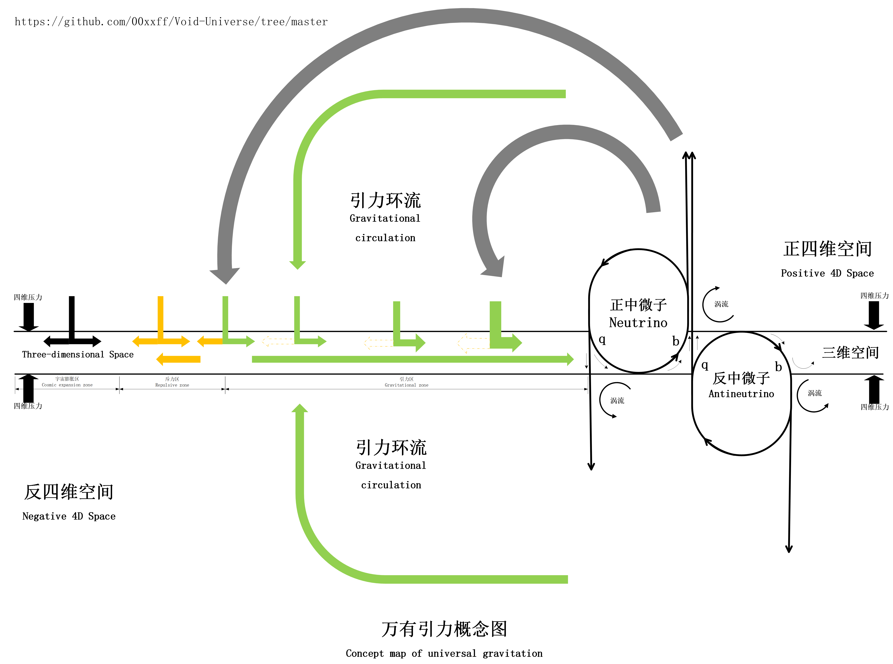

# [English](https://00xxff.github.io/Void-Universe/en/) | [中文](../README.md)

### Preface

This model is an attempt to provide a unified explanation of all known physical phenomena through a reverse engineering project. It offers a complete four-dimensional universe explanatory framework for those who accept the four-dimensional universe concept.
The model achieves intuitive descriptions of various fundamental physical phenomena by using two types of elementary particles, A and B, forming a dynamically stable system within a four-dimensional coordinate system.

*Hypothetical Void Universe: In a four-dimensional space filled with extremely small-scale B particles, there are numerous chaotic A particles. The continuous energy input from A particles drives the formation of a three-dimensional layer (three-dimensional membrane) where the pressure of B particle flow along the w-axis is balanced. More and more A particles then collide with this three-dimensional membrane and respectively adhere to both sides of it. Due to the characteristics of A particles (high-frequency vibrations), they drive unidirectional B particle flows, bringing more stable equilibrium conditions to this three-dimensional membrane, hence giving birth to a universe.
For ease of understanding, we found concepts in existing theories that closely resemble the properties of these two particles. We named the three-dimensional form of A particles as "neutrinos" and the three-dimensional form of B particles as "ether."
In four-dimensional space, we have renamed their four-dimensional forms as "virtual particles" and "void particles," respectively. (Note: These are not related concepts in quantum mechanics.)*

The principles of this model are simple and easy to understand. By attributing the origins of zero-point energy of basic particles' ground states, nuclear energy of atomic nuclei, and dark energy driving cosmic expansion—all vast energy sources that current theories cannot explain—to a more fundamental type of basic particle, and together with another type of basic particle capable of transmitting energy, a four-dimensional physical framework describable by quantum mechanics, thermodynamics, and fluid dynamics is formed. Within this framework, many previously difficult-to-understand macroscopic and microscopic physical phenomena can be easily explained. Various action mechanisms within the model framework can be derived and verified using existing theories and mathematical tools.
Within this model, you will find:

* Universal gravitation is essentially a result of four-dimensional fluid action and three-dimensional fluid pressure;
* The root of electromagnetic force lies in localized four-dimensional pressures formed by transient vortex bodies;
* Photons are a kind of four-dimensional interface wave, appearing like leapfrogging particles when viewed in our three-dimensional interface;
* In relativity, time dilation actually occurs because external pressure causes some physical phenomena to become more stable;
* Space is genuinely expanding;

Recommended reading order for model theory:

1. [Void Universe Hypothesis](Void%20Universe%20Model%20and%20Reasoning/Void%20Universe%20Hypothesis.md)
2. [Overview Definition of Void Model](Void%20Universe%20Model%20and%20Reasoning/Overview%20Definition%20of%20Void%20Model.md)
3. [Electric Field and Magnetic Field](Void%20Universe%20Model%20and%20Reasoning/Electric%20Field%20and%20Magnetic%20Field.md)
4. [Propagation of Light and Wave-Particle Duality](Void%20Universe%20Model%20and%20Reasoning/Propagation%20of%20Light%20and%20Wave-Particle%20Duality.md)
5. [Michelson-Morley Experiment](Void%20Universe%20Model%20and%20Reasoning/Michelson-Morley%20Experiment.md)
6. [Special Relativity and Fate Gears](Void%20Universe%20Model%20and%20Reasoning/Special%20Relativity%20and%20Fate%20Gears.md)
7. [Gravity and Void Pressure](Void%20Universe%20Model%20and%20Reasoning/Gravity%20and%20Void%20Pressure.md)
8. [Phenomena of General Relativity](Void%20Universe%20Model%20and%20Reasoning/Phenomena%20of%20General%20Relativity.md)
9. [Quantum Entanglement](Void%20Universe%20Model%20and%20Reasoning/Quantum%20Mechanics/Quantum%20Entanglement.md)
10. [AI-Quantum Tunneling Effect](Void%20Universe%20Model%20and%20Reasoning/Quantum%20Mechanics/AI-Quantum%20Tunneling%20Effect.md)
11. [AI-Electron Orbital Energy Levels and Transition](Void%20Universe%20Model%20and%20Reasoning/Quantum%20Mechanics/AI-Electron%20Orbital%20Energy%20Levels%20and%20Transition.md)

AI Modeling:

* [Universal Gravity Modeling](AI%20Verification/Universal%20Gravity%20Modeling.md)
* [Void Particle Four Dimensional Circulation Modeling](AI%20Verification/Void%20Particle%20Four%20Dimensional%20Circulation%20Modeling.md)
* [Quantum model of photons](AI%20Verification/Quantum%20model%20of%20photons.md)

AI Prompt References:

* [Qwen2.5Max Prompt](AI%20Prompts/Qwen2.5Max%20Prompt.txt)
* [AI Verification and Derivation Prompt Reference](AI%20Prompts/AI%20Verification%20and%20Derivation%20Prompt%20Reference.md)

AI Derivation Results:

* [Interference of Light and Double-Slit Experiment](AI%20Verification/Interference%20of%20Light%20and%20Double-Slit%20Experiment.md)
* [Neutrino Oscillations and Cosmic Microwave Background Radiation](AI%20Verification/Neutrino%20Oscillations%20and%20Cosmic%20Microwave%20Background%20Radiation.md)

#### Speech

The basic theories of this model have been gradually refined and improved with the assistance of the [[Qwen 2.5]](https://chat.qwenlm.ai/) model. Here, I express gratitude to Alibaba.

Currently, this model remains only a theoretical framework, and its contents require further efforts from more individuals to refine and experimentally verify it, so that it can become a true grand unified model.

Now, if anyone is interested in this void model, you can directly copy the AI prompts and have the AI large model assist in conducting an in-depth interpretation or verification of the parts that interest you.

I look forward to more people joining in to complete the reverse engineering of our universe.

Finally, welcome to join the team exploring the universe with AI, using our minds to harness AI in the quest for the truth of the universe, making everyone an Einstein in this age of AI.
