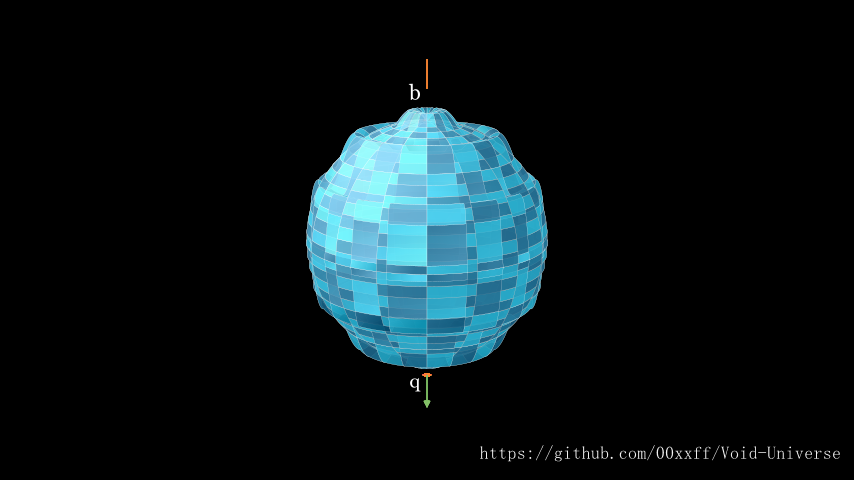
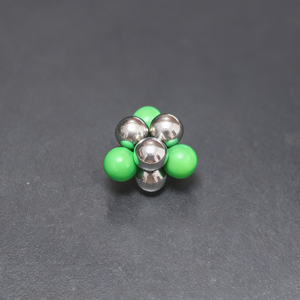
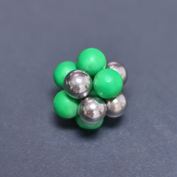

# Standard Model Particle Structure Reconstruction

——Void Universe Hypothesis: Low-Energy Equivalent Interpretation of Standard Model Particle Fluid Topology

### 1. Core Building Block: Topological Properties of Virtual Particles (Neutrinos)

Before reconstructing the Standard Model, we must clarify the physical properties of the fundamental building blocks:

* **Ontology**: $S^3$ topological wave oscillator with unidirectional light-speed traveling wave on its surface.
* **Dipole Definitions**:
  * **$q$-pole (Source)**: Exit/entrance of four-dimensional through-flow. For positive neutrino ($\nu$), $q$-pole points from $w>0$ to $w<0$; for antineutrino ($\bar{\nu}$), $q$-pole points from $w<0$ to $w>0$.
  * **$b$-pole (Sink)**: Unidirectional sink from three-dimensional membrane $\to$ four-dimensional space. Responsible for extracting void particles from three-dimensional space to maintain circulation.
* **Charge Assignment**:
  * Single positive neutrino $q$-pole flux corresponds to charge $-\frac{1}{3}e$.
  * Single antineutrino $\bar{q}$-pole flux corresponds to charge $+\frac{1}{3}e$.
  * $b$-pole carries no net charge, but contributes mass and gravitational source terms.
* **Chirality**: Positive neutrinos localized at $w>0$, antineutrinos localized at $w<0$. This unilateral localization is the geometric origin of weak interaction parity violation.

---

### 2. Lepton Family Reconstruction: Simple Aggregates with Unilateral Localization

Leptons consist of neutrinos of the same chirality, have simple structures, are not locked to the membrane, and exhibit high-frequency four-dimensional oscillations.

#### 2.1 Electron ($e^-$)

* **Composition**: 3 positive neutrinos ($qqq$).
* **Topological Configuration**: Triangular arrangement forming a funnel-like aggregation channel.
* **Flux Characteristics**:
  * **Net Flux**: $\Phi_{net} = 3 \times (-\frac{1}{3}e) = -1e$. Direction $w>0 \to w<0$.
  * **Total Flux**: Small. Due to lack of $b$-pole ejection effect from opposite neutrinos and free $b$-poles, pumping efficiency is low.
* **Physical Manifestations**:
  * **Small Mass**: Total effective flux $\Phi_{total}$ is small, hence inertial mass is small.
  * **Large Charge**: High ratio of net flux, electric field is significant.
  * **Unilaterality**: Mainly active on $w>0$ side, causing unilateral bias in microscopic magnetic field (macroscopic symmetry averaged by high-frequency oscillation).
  * **Stability**: Due to simple structure, susceptible to topological reconnection under high-energy perturbations (e.g., role conversion in $\beta$ decay).

#### 2.2 Positron ($e^+$)

* **Composition**: 3 antineutrinos ($\bar{q}\bar{q}\bar{q}$).
* **Topological Configuration**: Mirror symmetric to electron, localized on $w<0$ side.
* **Flux Characteristics**: Net flux $+1e$, direction $w<0 \to w>0$.
* **Physical Manifestation**: CPT conjugate of electron.

#### 2.3 Neutrinos ($\nu_e, \nu_\mu, \nu_\tau$)

* **Composition**: Single positive neutrino or antineutrino.
* **Topological Configuration**: Isolated $S^3$ oscillator.
* **Flux Characteristics**:
  * **Net Flux**: $\pm \frac{1}{3}e$ (but usually shielded or canceled in macroscopically neutral environments, appearing as weak charge).
  * **Total Flux**: Extremely small. Free $b$-pole pumping efficiency is extremely low, barely extracting momentum from three-dimensional membrane.
* **Physical Manifestations**:
  * **Extremely Small Mass**:接近零。
  * **Extremely Weak Interaction**: Only interacts via weak force (unilateral chiral resonance) and gravity.
  * **High Penetration**: Can easily pass through matter due to lack of strong coupling sink flow with three-dimensional membrane.

##### 2.3.1 Fractional Charge Fluid Shielding Mechanism of Isolated Neutrinos (Far-Field Flux Tube Closure)
In the Standard Model, isolated neutrinos appear electrically neutral (or only have weak charge). In the void framework, although a single positive neutrino's $q$-pole carries a nominal four-dimensional flux of $-1/3e$, it cannot excite a long-range Coulomb field macroscopically (four-dimensional normal pressure gradient $\nabla(\Delta p_\perp) \approx 0$). Its fluid topological shielding mechanism is as follows:

1. **Hydrodynamic Dead Zone and Pump Failure**: Establishment of long-range Coulomb field relies on coordinated pumping between $b$-pole and $q$-pole to form a cross-dimensional high-pressure ejection network. The free $b$-pole of an isolated neutrino has extremely low pumping efficiency and cannot extract sufficient momentum from the three-dimensional membrane to support far-field expansion of the $q$-pole jet.
2. **Four-Dimensional Flux Tube Self-Closure (Dipole Tight Binding)**: Due to lack of external topological interlocking (e.g., $qqq$ aggregation), after traveling an extremely short distance ($\sim \ell_{\text{min}}$) from the $S^3$ surface, the $q$-pole jet of an isolated neutrino inevitably forms a **closed loop** with its own fluid wake (or higher-dimensional mirror backflow) due to compression from background pressure on the four-dimensional side.
3. **Far-Field Gradient Truncation**: This minimal-scale flux tube self-closure causes its four-dimensional normal pressure perturbation $\delta p_\perp$ to decay exponentially (dipole near-field characteristic), with far-field normal pressure gradient strictly zero.
**Conclusion**: Only when 3 neutrinos form a $qqq$ aggregate (e.g., electron) does the topological interlocking network force the flux tube to remain open to the far field rather than closing in the near field, releasing accumulated pressure and emerging as a macroscopic $-1e$ long-range Coulomb potential. The "fractional charge" of isolated neutrinos is perfectly shielded within the hydrodynamic dead zone.

---

### 3. Quark Family Reconstruction: Local Topological Modes Rather Than Independent Particles

**Key Correction**: Quarks are not independently existing entities, but **locally stable neutrino combination modules** within baryons. They maintain relatively independent configurations within the large topological network of atomic nuclei, but connect to other modules through peripheral $b$-$q$ nodes.

#### 3.1 Up Quark ($u$)

* **Hypothesized Composition**: 4 neutrinos (2 positive, 2 negative? Or more complex compressed structure).
  * According to early descriptions in *Void Universe Hypothesis*: Up quark carries $+\frac{2}{3}e$.
  * **Topological Implementation**: Possibly composed of 2 antineutrinos ($\bar{q}\bar{q}$) and 2 positive neutrinos ($qq$), but through special $b$-pole interlocking, net flux becomes $2 \times (+\frac{1}{3}) + 2 \times (-\frac{1}{3}) = 0$? Incorrect.
  * **Corrected Logic**: To obtain $+\frac{2}{3}e$, net flux needs to be $+2/3$.
  * **Possible Configuration**: Dominated by 2 antineutrinos, supplemented by a small number of positive neutrinos to balance topological stiffness. Alternatively, more simply, regarded as **a local high-density vortex filament cluster within a proton**, whose overflow field exhibits effective charge of $+\frac{2}{3}e$.
  * **Note**: From a modular perspective, the "fractional charge" of a quark is a **local flux projection** when it acts as part of the overall network, not an intrinsic property of an independent particle.

#### 3.2 Down Quark ($d$)

* **Hypothesized Composition**: 5 neutrinos.
* **Charge**: $-\frac{1}{3}e$.
* **Topological Implementation**: Local vortex filament cluster with net flux projection of $-1/3e$.

**Explanation of Quark Confinement**:
Since quarks are only local modes, attempting to separate them means cutting their $b$-$q$ connections with surrounding modules. This disrupts local flux balance, triggering vacuum topological reconnection and generating new mesons (e.g., $\pi$ meson), making isolated quarks unobtainable forever.

---

### 4. Baryon Family Reconstruction: Highly Symmetric Closed Vortex Filament Networks

Baryons are fundamental building blocks of atomic nuclei, consisting of highly symmetric, high-rigidity closed topological structures composed of multiple neutrinos. They are firmly locked to the three-dimensional membrane.

#### 4.1 Proton ($p^+$)

* **Composition**: 9 neutrinos (3 positive, 6 negative).
* **Topological Configuration**: **Triangular prism with three lateral cones** (Triangular Bipyramid / Trigonal Prism variant).
  * **Vertices**: 3 positive neutrinos. $q$-poles pointing downward ($w>0 \to w<0$).
  * **Sides/Bases**: 6 antineutrinos. Divided into two groups, each forming a $qqq$ array (similar to positron structure), $q$-poles pointing upward ($w<0 \to w>0$).
* **Flux Balance**:
  * **Total Flux ($\Phi_{total}$)**: Extremely large. Internal $q$-$b$ interlocking forms an efficient ejection pump, extracting massive void particles from three-dimensional membrane. $\rightarrow$ **Large mass**.
  * **Net Flux ($\Phi_{net}$)**:
    * Vertex contribution: $3 \times (-\frac{1}{3}e) = -1e$ (downward).
    * Base contribution: $6 \times (+\frac{1}{3}e) = +2e$ (upward).
    * **Net Result**: $+2e - 1e = +1e$ (upward, i.e., $w<0 \to w>0$).
  * **Charge**: $+1e$.
* **Stability**: Highly symmetric geometric structure causes tangential momentum to strictly cancel and normal momentum to efficiently converge. Topological stiffness is extremely large, difficult to be disrupted by external perturbations.

#### 4.2 Neutron ($n^0$)

* **Composition**: 12 neutrinos (6 positive, 6 negative).
* **Topological Configuration**: **Icosahedron** or other highly symmetric polyhedron.
* **Flux Balance**:
  * **Total Flux ($\Phi_{total}$)**: Extremely large, comparable to proton. $\rightarrow$ **Large mass**.
  * **Net Flux ($\Phi_{net}$)**:
    * 6 positive neutrinos contribute: $6 \times (-\frac{1}{3}e) = -2e$.
    * 6 antineutrinos contribute: $6 \times (+\frac{1}{3}e) = +2e$.
    * **Net Result**: $0$.
  * **Charge**: $0$.
* **Stability**: Although electrically neutral, internal vortex filament network is similarly closed and highly rigid. Without net charge, it is unaffected by long-range electromagnetic forces, but binds with other nucleons through residual topological stress at short range.

#### 4.3 Other Baryons ($\Lambda, \Sigma, \Xi, \Omega$, etc.)

* **Composition**: Include neutrino combinations corresponding to strange quarks.
* **Topological Interpretation**: Introduce neutrino variants with different chiralities or oscillation frequencies, leading to reduced symmetry or increased internal stress in topological structures, thus exhibiting higher mass and instability (prone to decay).

---

### 5. Meson Family Reconstruction: Transient Topological Excitation Modes

Mesons are not fundamental particles, but **transient topological excitations** or **broken vortex filament segments** exchanged between baryons.

#### 5.1 $\pi$ Meson ($\pi^+, \pi^-, \pi^0$)

* **$\pi^+$**: Composed of one up quark module and one anti-down quark module.
  * **Topological Picture**: A local vortex filament protrusion on the proton surface, or an instantaneous bridging structure produced during baryon-baryon collisions.
  * **Short Lifetime**: Because this configuration is not a global energy minimum, it rapidly decays into leptons via topological reconnection (e.g., $\mu^+ + \nu_\mu$).
* **$\pi^0$**: Composed of up-down quark pair with zero net flux, rapidly annihilates into photons (interface wave packets).

---

### 6. Gauge Boson Reconstruction: Quantized Excitations of Fields

In the void model, gauge bosons are **collective excitation modes in void particle fluid**, not independent particles.

#### 6.1 Photon ($\gamma$)

* **Essence**: **Interface wave packet** on three-dimensional membrane.
* **Generation Mechanism**: Virtual particle surface traveling waves impinge on three-dimensional membrane, exciting four-dimensional interface waves.
* **Properties**: No rest mass (no $b$-pole sink flow), propagates at sound speed $c$. Transverse wave property originates from impedance mismatch filtering in photon-electron collision absorption dynamics.

#### 6.2 $W^\pm, Z^0$ Bosons

* **Essence**: **Transient vortex clusters** or **topological defects** at high energies.
* **Generation Mechanism**: High-energy collisions cause violent fluctuations in local void particle density, forming short-lived high-energy vortex structures.
* **Mass Origin**: These vortex clusters have large effective inertia (due to high-frequency oscillation and local density accumulation), appearing as massive.
* **Weak Force Carrier**: Due to involvement of unilateral chiral neutrino recombination, only couples to left-handed fermions, causing parity violation.

#### 6.3 Gluon ($g$)

* **Essence**: **Elastic vibration modes** of vortex filament networks within baryons.
* **Role**: Transmit topological tension between quark modules.
* **Confinement**: Gluons themselves are also part of topological structures, unable to exist independently outside baryon networks.

#### 6.4 Higgs Boson ($H$)

* **Essence**: **Density fluctuation resonance mode** of void particle sea or **critical excitation of topological phase transition**.
* **Role**: At high energies, transient broken morphologies produced by peripheral topological collision excitation or particle closed topology tearing (by changing coupling efficiency of $R_0$ or $\phi$).
* **Observation**: Transient high-density vortex clusters produced in high-energy collisions, with extremely short lifetime ($\sim 10^{-22}$ s).

---

### 7. Summary: Void Topology Mapping Table for Standard Model Particles

| Standard Model Particle | Void Model Composition | Topological Feature | Mass Origin | Charge Origin | Notes |
| :--- | :--- | :--- | :--- | :--- | :--- |
| **Electron ($e^-$)** | 3 positive neutrinos ($qqq$) | Unilateral funnel, high-frequency oscillation | Small total flux | Net flux $-1e$ | Lepton, active |
| **Positron ($e^+$)** | 3 antineutrinos ($\bar{q}\bar{q}\bar{q}$) | Unilateral funnel, mirror | Small total flux | Net flux $+1e$ | Antilepton |
| **Neutrino ($\nu$)** | 1 neutrino | Isolated $S^3$ | Extremely small total flux | Net flux $\pm 1/3e$ (weak charge) | High penetration |
| **Up Quark ($u$)** | Local module (2 anti + ?) | Local cluster inside proton | Flux within module | Local projection $+2/3e$ | Not independent entity |
| **Down Quark ($d$)** | Local module (1 positive + ?) | Local cluster inside proton | Flux within module | Local projection $-1/3e$ | Not independent entity |
| **Proton ($p^+$)** | 9 neutrinos (3 positive, 6 negative) | Triangular prism with three lateral cones, closed network | **Large total flux** (efficient pumping) | Net flux $+1e$ | Baryon, stable |
| **Neutron ($n^0$)** | 12 neutrinos (6 positive, 6 negative) | Icosahedron, closed network | **Large total flux** | Net flux $0$ | Baryon, stable |
| **Photon ($\gamma$)** | Interface wave packet | No $b$-pole, pure wave | No mass | None | Electromagnetic force carrier |
| **$W/Z$ Bosons** | Transient high-energy vortex cluster | Short-lived topological defect | Total angular momentum of vortex | Weak charge | Weak force carrier |
| **Gluon ($g$)** | Vortex filament elastic vibration | Internal stress wave of network | No mass | Color charge (topological connectivity) | Strong force carrier |
| **Higgs ($H$)** | Density fluctuation resonance mode | Medium elastic excitation | Total angular momentum of vortex | None | Mass-like mechanism related |