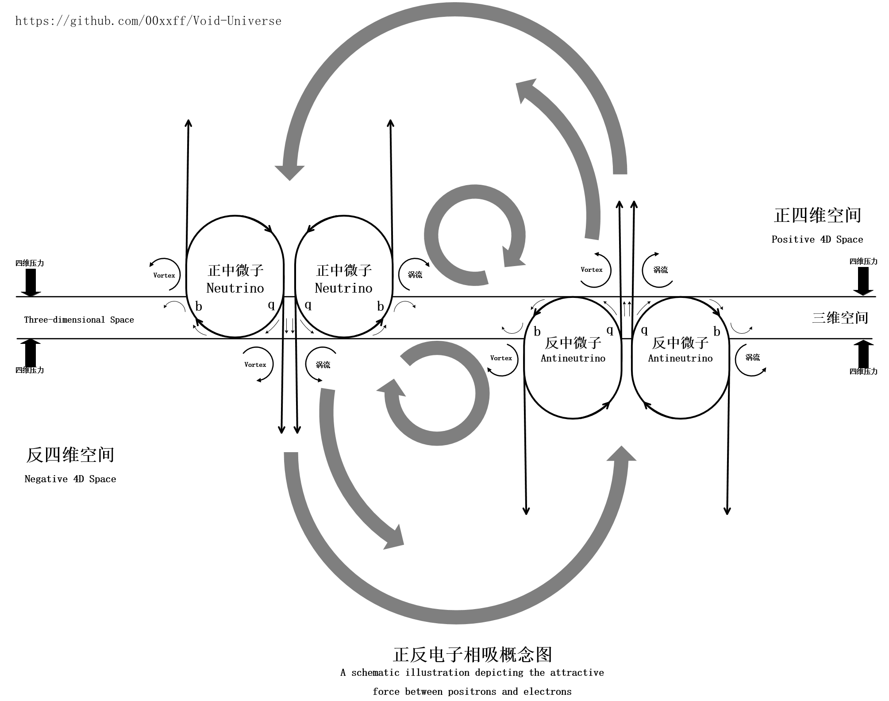

### Electric Field and Magnetic Field

Every time I play with two strong magnets in my hands, repeatedly bringing them close and then separating them, I feel the immense repulsive and attractive forces without any other sensation in my hands. This makes me clearly realize that the world is at least four-dimensional.

This realization was the initial driving force that pushed me to explore the truth of the universe. Therefore, we will start our analysis of electromagnetic forces from the perspective of four-dimensional space.

In the origin of the universe, we assumed that our universe is enveloped by positive and negative four-dimensional spaces. Because of the existence of the three-dimensional space at the four-dimensional zero point where we reside, we can divide the fourth-dimensional coordinate into two parts: positive and negative. We refer to these two parts as the positive and negative poles of the four-dimensional space (or simply the positive and negative poles). These are the roots of matter and antimatter.

The bottom part of the "fate gear" passes through our three-dimensional space, making the three-dimensional space we occupy special — it is the root of the formation and maintenance of the material universe. The oscillations at the bottom of the fate gear occur entirely within our three-dimensional space, which is crucial because it divides the fate gears into positive and negative types. While each fate gear independently exists as a single-sided circulation of void particles, combining them in different orientations creates different vortex structures, forming the basis for various fundamental particle structures. The part of the fate gear that rotates within three-dimensional space plays a key role in transforming the four-dimensional counteraction of electromagnetic forces into three-dimensional kinetic momentum vectors via angular momentum conversion.

If we consider the fate gear as the energy core of matter and the void particles as the "flesh" of matter, then the electromagnetic force is akin to the "bones" that support this flesh.

The vortices formed by void particles driven by the fate gear in four-dimensional space create a bipolar circulation structure that spans three-dimensional space. Due to the differing flow directions of this circulation, fields of void particles with different flow directions form in four-dimensional space, creating what we know as electric fields. According to classical physics, we define the polarity of void particle flows in four-dimensional space such that positive charges flow outward and negative charges flow inward. We define the circulation of void particles from the negative pole of four-dimensional space to the positive pole as a positive electric field (three-dimensional flow directed outward toward the positive pole of four-dimensional space), and the circulation from the positive pole of four-dimensional space to the negative pole as a negative electric field (positive pole of four-dimensional space flowing inward toward three-dimensional space).

Let’s first attempt to construct a positively charged electron in our universe:
We assume that three positive fate gears rotating on the side from four-dimensional to three-dimensional space combine together ($qqq$ combination), forming a stable triangular structure. At the center of this triangle, the three negative electric field circulations merge into a large flow of void particles from the positive pole of four-dimensional space to its negative pole. Simultaneously, part of this void particle flow forms an external jet in three-dimensional space following the rotation of the fate gear, while another part continues to be drawn back into the positive pole of four-dimensional space from three-dimensional space, forming a closed loop circulation.

Thus, we obtain a negatively charged (positive) electron $e^-$. The core void particle flow of this electron moves from the negative pole of four-dimensional space to its positive pole. In three-dimensional space, its structure resembles a jet emanating outward from the core, metaphorically speaking, like a large rocket topped with three fate gears. This three-dimensional structure makes electrons highly active, moving rapidly and chaotically within the atomic space constrained by the electric field, thereby exhibiting the characteristics of an electron cloud. Conversely, when we use three anti-fate gears (anti-neutrinos) combined in the same way ($\bar{q}\bar{q}\bar{q}$ combination), we obtain a positively charged (anti) electron, or positron $e^+$.

Under normal circumstances, around the atomic nucleus, due to its own positive charge, a spherical vortex zone of void particles forms, achieving overall balance between the inflow and outflow of void particles relative to the electron's jet. This self-circulating vortex zone isolates external void particle flows, directly restricting the motion range of electrons.

Next, we analyze the interactions of the electric field:
Like charges repel each other because their four-dimensional void particle flows have the same direction, thus producing fluid polarity. Therefore, the interaction between the four-dimensional void particle flows of unlike charges results in pressure differences in four-dimensional space, causing particles to exhibit repulsion between like charges and attraction between opposite charges in four-dimensional space.

How does current form? The interaction of electric fields imparts more four-dimensional kinetic energy to electrons, elevating their orbital energy levels. This makes the quantum state of electrons oscillate more violently until, at some moment, a tunneling phenomenon occurs. Free electrons escape the electric field constraints of the lattice formed by atoms and move towards the positive pole of the electric field, thereby forming a current. The ability of substances to restrict the movement of electrons is characterized by the dielectric constant.

Next, we continue analyzing how magnetic fields are generated:
Let’s take the example of an electron generating magnetism during its motion. When an electron moves in three-dimensional space, in the positive four-dimensional space, the four-dimensional part of the virtual particle flow follows the electron’s motion, forming a vortex band parallel to three-dimensional space. Similarly, in the negative four-dimensional space, another vortex band parallel to three-dimensional space forms. The three-dimensional momentum direction of the void particles in these vortex bands aligns with the electron's momentum and rotates perpendicularly to three-dimensional space as part of the four-dimensional vortex. If we imagine the three-dimensional rotational part of this vortex as a spinning gyroscope in three-dimensional space, it is as if this vortex is being rapidly flipped by the four-dimensional vortex. Thus, this vortex generates a precession perpendicular to the three-dimensional vortex rotation direction (particle motion direction), driving surrounding void particles to form a new particle flow perpendicular to the motion direction. This particle flow constitutes the magnetic field of the electron.

When other charged particles move within the range of these two vortex bands, they are influenced by the local pressure gradient formed by the vortex, resulting in trajectory deviations — this is the effect of magnetic force.
When two magnetic field vortices approach each other, if their precession directions are the same, they produce a local low-pressure region; if their directions are opposite, they also produce a local low-pressure region. This explains the behavior of like poles repelling and opposite poles attracting.
Since a magnetic field is a precessional vortex, there must exist two directions — incoming and outgoing — corresponding to the two poles of the magnetic field. Thus, magnetic monopoles do not exist. However, if complex four-dimensional vortices could be artificially created, it might still be possible to generate vortices with monopole-like properties.

The composition of other fundamental particles:

In the standard model, the spin of particles describes the symmetry and direction of four-dimensional void particle circulations.
For instance:
The oscillation of neutrinos is four-dimensional, so their rotational behavior can be described using unit quaternions, which have a periodicity of 720°, meaning they need to rotate twice to return to their original state.
Thus, the spin number of neutrinos is 1/2, determined by their four-dimensional oscillatory characteristics and rotational behavior.

The chirality features of positive and negative neutrinos determine that other fundamental particles composed of them also possess chirality characteristics.

By analyzing the conceptual diagrams of positive and negative electrons, we can tentatively infer that the charge numbers of fundamental particles are related to the four-dimensional penetrating flows of void particles.

Based on this, we attempt to speculate on the composition of other particles (fermions):

Protons and neutrons appear externally as composed of up and down quarks, but it is speculated that they should also contain a large number of equal $bb\bar{q}$ and $\bar{b}\bar{b}q$ neutrinos forming quark-antiquark pairs.
Thus, protons and neutrons can be considered as composed of combinations of $bb\bar{q}$ and $\bar{b}\bar{b}q$ positive and negative neutrinos, but their combinations differ. Protons are completely balanced combinations, whereas neutrons have three additional groups of $bb\bar{q}$.

An up quark is composed of six adjacent neutrinos (2 positive 1 negative $bb\bar{q}$ + 2 positive 1 negative $bb\bar{q}$) (electric field penetrating flow 2 positive).

A down quark is composed of nine adjacent neutrinos (2 positive 1 negative $bb\bar{q}$ + 1 positive 2 negative $\bar{b}\bar{b}q$ + 1 positive 2 negative $\bar{b}\bar{b}q$) (electric field penetrating flow 1 positive 2 negative).

Since fermions are all composed of neutrinos and possess chirality, their rotational behavior can also be described using unit quaternions, hence their spin number is 1/2.

**Note**: Quarks are primarily composed of $bbq$ combinations of positive and negative neutrinos. These $bbq$ combinations continuously extract void particles from three-dimensional space and inject them into four-dimensional space, forming a void pressure deficit zone at the mass center in three-dimensional space, leading to the formation of void particle flows from the periphery of three-dimensional space towards the mass center. This is the foundation for the formation of universal gravitation.

The composition of bosons:

Various bosons can essentially be viewed as different void particle vortices or mechanical waves propagating through void particles. Therefore, the spins of bosons are either 1 or 0, and their chirality is described solely by their helicity.

---

The four-dimensional fluid structures described above are simplified assumptions made for easier understanding by ordinary people. In reality, the specific four-dimensional fluid may be much more complex super-space forms, so the detailed theoretical models still require further derivation and refinement by many researchers.

---

### Summary

1. **Electric Field**: 
   - The electric field arises from the bipolar circulation of void particles in four-dimensional space caused by the fate gear.
   - Positive charges correspond to void particles flowing outward from the positive pole of four-dimensional space, and negative charges correspond to void particles flowing inward toward the negative pole of four-dimensional space.

2. **Magnetic Field**: 
   - When charged particles (like electrons) move in three-dimensional space, their motion induces vortices in both positive and negative four-dimensional spaces, which manifest as magnetic fields in three-dimensional space.
   - The precession of these vortices drives the formation of new particle flows perpendicular to the particle motion direction, constituting the magnetic field.

3. **Charge Formation**:
   - The charge of fundamental particles is determined by the orientation of void particle flows in four-dimensional space.

4. **Spin Characteristics**:
   - Fermions are all composed of neutrinos and exhibit chirality, so their rotational behavior can be described using unit quaternions, giving them a spin of 1/2.

5. **Gravitational Basis**:
   - The $bbq$ combinations of quarks draw void particles from three-dimensional space into four-dimensional space, forming a void pressure deficit zone at the mass center in three-dimensional space. This process leads to the formation of void particle flows from the periphery toward the mass center, serving as the foundation for universal gravitation.

6. **Boson Composition**:
   - Bosons can be seen as different void particle vortices or mechanical waves propagating through void particles, with spins of either 1 or 0, and their chirality described by helicity.

All of the above descriptions are simplified assumptions to make the concept of four-dimensional fluids understandable to the general public. In reality, the actual four-dimensional fluid structures might be extremely complex super-space forms, and the precise theoretical models still require further derivation and refinement by many researchers.