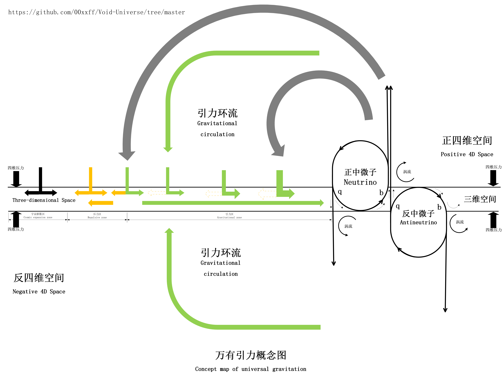

### Gravitational Attraction and Void Pressure

What is gravitational attraction?

First, let us list the characteristics of gravitational attraction:

1. Gravitational attraction is only related to the mass of matter, independent of volume, density, state of motion, etc.
2. Gravitational attraction appears omnipresent and can instantly act at infinite distances.
3. Gravitational attraction does not interact with electromagnetic forces.
4. The gravitational interaction between two mass systems conforms to Newton's law of universal gravitation.
5. Gravitational attraction can cause space distortion, light path distortion, and even form black holes.

Now, based on these characteristics, we will start reasoning step by step to explore the cause of gravitational attraction:

Firstly, gravitational attraction is only related to the mass of matter, which means that the aggregation of mass leads to a proportional increase in some factor. In our void model, this corresponds to the proportional accumulation of void particles caused by the aggregation of mass, and the continuous dimensional reduction of core virtual particles results in a sustained proportional increase in the number of void particles.

Next, considering an omnipresent force that acts instantaneously over long distances, the closest explanation within our understanding is "pressure." Therefore, we can assume that gravitational attraction is related to the collective pressure of void particles in three-dimensional space (i.e., sub-pressure of the void) and subsequently attempt to verify whether void pressure can produce other characteristic phenomena of gravitational attraction.

Gravitational attraction does not interact with electromagnetic forces. In our void model, electromagnetic forces are interactions of four-dimensional void particle flows, while gravitational attraction is the three-dimensional spatial void pressure, and the two do not interfere with each other, which is consistent with reality.

The gravitational interaction between two mass systems conforms to Newton's law of universal gravitation. If we assume that gravitational attraction originates from the void pressure in three-dimensional space, then its distribution in the three-dimensional space where the mass system resides must be spherical, and the pressure distribution increases from the outside inward. Since it is spherically distributed, the mathematical form of its mechanics can fully conform to the formula for universal gravitation.

Next, we continue to deduce from the formation to the principle of action of void pressure to see if it can fit our assumed spherical gradient: Void particles gather and stack in four-dimensional space, forming a super-sphere that diffuses outward with mass as the center. In the central part of the sphere, a large amount of matter gathers, i.e., a large number of fate gears gather. From the concept diagram of the fate gear (neutrino), we can observe that its q-pole brings in a small amount of void particle flow from four-dimensional space, while its b-pole draws in more void particle flow back into four-dimensional space. Therefore, the mass core can actually be regarded as a vortex channel of void particles transitioning from three-dimensional to four-dimensional space. Our universe is a three-dimensional membrane in the entire four-dimensional space where pressure is balanced; this membrane continuously incorporates countless positive and negative four-dimensional void particles and generates uniform diffusion pressure in three-dimensional space, i.e., our universe's void is constantly expanding. The closer to the center of mass aggregation, the greater the density and number of void particles, resulting in greater expansion pressure, which is the process of four-dimensional void particles entering the three-dimensional membrane. In the three-dimensional membrane, the mass center is equivalent to a black hole, where spacetime swallows a large number of void particles into four-dimensional space, forming a void particle flow from the periphery of the mass center toward the center of the mass, macroscopically appearing as the entire void falling toward the mass center. This constitutes the super-dimensional pressure circulation of the entire mass system. Within this circulation (within the range of gravitational influence), two objects move closer due to fluid pressure differences, manifesting as gravitational attraction in three-dimensional space.

When a large amount of matter aggregates, this super-dimensional circulation becomes more pronounced.

In summary, due to the pressure of positive and negative four-dimensional spaces, countless void particles are constantly intruding into three-dimensional space (the three-dimensional membrane), forming a uniform three-dimensional expansion pressure, which is the background pressure of three-dimensional space.
The density distribution of void particles in four-dimensional space forms a super-sphere around the mass center, gradually decreasing from the center to the periphery. Therefore, the four-dimensional pressure on the three-dimensional membrane also decreases from the center to the periphery, and the number of void particles entering the three-dimensional membrane along with this pressure also decreases from the center to the periphery, thus forming a spherical "incremental" pressure gradient increasing from the outside inward around the mass center in three-dimensional space.
In three-dimensional space (the three-dimensional membrane), the formation of matter's mass mainly consists of a large number of bbq neutrino composite structures. The aggregation of a large number of such bbq structures causes void particles to be continuously extracted from the three-dimensional membrane and flow into four-dimensional space, forming a three-dimensional void low-pressure zone at the mass center. Under the combined effect of three-dimensional void background pressure and void incremental pressure, a pressure gradient increasing from the outside inward and a void particle flow from the periphery toward the mass center are formed.
We call this spherical void particle flow region the gravitational zone of the material's void sphere (which can be understood as a space collapse zone), and outside the boundary of the void sphere's gravitational zone, the void particle incremental pressure gradually decreases until it equals the void background pressure, this spherical region is the material's void sphere, we refer to the part from the boundary of the material's void sphere to the boundary of the void sphere's gravitational zone as the repulsive zone of the void sphere (which can be understood as a space expansion zone).
When the gravitational zones of two mass systems' void spheres overlap, local pressure differences are generated, producing a gravitational phenomenon under the impetus of the void background pressure.
When one mass system is completely inside another larger mass system's void sphere gravitational zone, the gravity it experiences is mainly determined by the gradient pressure formed by the void particle flow and the void particle incremental pressure in that region.

When a supermassive system dominates, the gravity experienced by other smaller masses mainly originates from the space collapse effect produced by the void particle gravitational circulation of that system, i.e., gravitational acceleration. That is, within the range of this gravitational field, regardless of the size or volume of the object, its gravitational acceleration at the same position is the same, which is the velocity of the four-dimensional permeating particle flow at that position (space collapse acceleration). It is like a sailboat being accelerated by a crosswind. However, here it is not because gravity produces acceleration, but because acceleration occurs first, followed by the corresponding force, i.e., acceleration comes first, and then "gravity". This is because, in our understanding, any change in the speed of an object must be due to the action of an external force, so we call this hypothetical "force" gravity. According to Newton's second law F=ma, we calculate and obtain the universal gravitation.

In the gravitational circulation diagram, the velocity of any four-dimensional-to-three-dimensional void particle flow within the circulation equals the velocity of the three-dimensional void particle flow at that position, which is equal to the gravitational acceleration at that position.
(Thus, we can make such an inference: in any point of the planetary/stellar system mass system, the velocity of the void particle flow equals the gravitational acceleration at that point, and the direction of the void particle flow equals the direction of the gravitational acceleration.)
(Therefore, the stationary Michelson-Morley experiment cannot detect the ether wind caused by Earth's orbital motion, because on the Earth's surface, there is only the ether flow pointing toward the Earth's center, and the speed is only about 9.8 m/s, which also accords with the gravitational redshift effect in general relativity. See: [Gravitational Redshift and Ether Wind](../AI%20Verification/Gravitational%20Redshift%20and%20Ether%20Wind.md))

(The problem of galactic dynamics can also be directly understood as the rotation of the entire group of void particles, i.e., the rotation of space, which is unrelated to the mass of the celestial bodies within it, so the shape of the galaxy's rotation is only related to the shape of the space rotation, and there is no need to introduce dark energy and dark matter to provide additional "gravity".)

Therefore, the gravitational potential energy between objects is mainly determined by the gradient of void pressure. When two massive objects attract each other due to universal gravitation and get closer, gaining kinetic energy, the kinetic energy gained by the objects due to universal gravitation is provided by the void pressure, unrelated to the objects' own energy. Neither object loses any energy; the extra kinetic energy they gain is provided by the void pressure, i.e., it comes from the zero-point energy of neutrinos.

From this perspective, when two mass systems are outside the range of mutual influence of their respective void spheres, their gravitational relationship depends on the void pressure distribution in the larger void sphere outside them. If the external void pressure is uniform or relatively small or even non-existent, the two mass systems will exhibit repulsion when approaching each other until the gravitational zone of one system's void sphere completely covers the other mass system, transforming into gravitational attraction conforming to the law of universal gravitation (the universal gravitation formula is also derived under such conditions). If the void spheres of both sides are not in a large-ball-containing-small-ball situation, it becomes quite complex, which indicates that the universal gravitation formula has limitations and is only applicable under certain conditions.

This also shows that the void is constantly expanding, and the universe is continuously expanding, rooted in the fact that void particles are still increasing exponentially, and the void expansion pressure makes the entire universe expand.

According to this inference, many astronomical data dependent on universal gravitation calculations may have issues, and the gravitational constant estimate may only apply within the solar system. We can try to analyze the trajectories of distant galaxies in the universe and calculate the sizes of void spheres and gravitational relationships to see if they match the actual observational results. This speculation can be used to prove that the interaction of void spheres produces gravity.

We try to compare with already discovered astronomical phenomena and find that astronomical phenomena related to dark matter may be related to the characteristics of void spheres:

1. Rotation curve problem: In the Milky Way and other galaxies, if only the gravitational effects of visible matter are considered, the rotational speed of stars at the edge of the galaxy should decrease with increasing distance. However, the observed situation is that the rotational speed of stars at the edge of the galaxy remains almost constant. This suggests that there is a large amount of invisible matter (i.e., dark matter) distributed in the outer regions of the galaxy, providing additional gravity to maintain these high speeds.
2. Dynamics of galaxy clusters: In galaxy clusters, the motion speeds of galaxies far exceed what can be explained by the gravity produced by visible matter alone. This suggests that there is a large amount of dark matter in galaxy clusters, providing sufficient gravity to maintain the stability of the galaxy cluster.
3. Large-scale structure of the universe: Galaxies in the universe are not randomly distributed but form complex network structures. The formation and evolution of these structures require a large amount of dark matter to provide necessary gravitational clustering mechanisms.

From these aspects, the manifestations of the rotation curve problem and the dynamics of galaxy clusters resemble the synchronized rotation of a mass system's void sphere.
The large-scale structure of the universe resembles the local accumulation of void pressure on a large scale in the universe, pushing galaxy clusters together like bubbles, forming network-like structures. Of course, these inferences are superficial and require further mathematical models and experimental evidence to prove.
If all these conform to mathematical derivations, "dark matter" may no longer exist.
It seems that the Michelson-Morley experiment doesn't need to be repeated?

From these phenomena, the interaction of void spheres in astrophysics needs to consider the relative persistent effects produced by the three-dimensional background pressure of the universe and the spin states of both parties.

Well, up to this point, we have argued that void pressure can explain most of the phenomena of universal gravitation. Next, we need to continue arguing about other situations: Universal gravitation can also cause space distortion, light path distortion, and even form black holes.

In the generation and propagation of light, we have made the inference that light propagates in void particles, and the density of void particles determines the speed of light propagation. Therefore, we infer that the spatial distortion caused by universal gravitation is actually the change in the density of void particles, and this density change causes the propagation path of light quanta to bend, producing a gravitational lens effect.

Additionally, in the gravitational zone of a material's void sphere, void particles flow from the boundary of the gravitational zone toward the mass center. The velocity of void particles generated by four-dimensional intrusion should be equal to the three-dimensional void particle acceleration at the intrusion point. Assuming that an object moves toward the mass center with a speed greater than or equal to the three-dimensional void particle flow speed, the gravitational acceleration it experiences is only produced by the incremental pressure of four-dimensional intrusion. Therefore, we can infer that the velocity of void particles generated by four-dimensional intrusion should be equal to the gravitational acceleration at the intrusion point, and the velocity of three-dimensional void particles should also equal the gravitational acceleration. When the gravitational acceleration near a black hole exceeds the speed of light, light inside the black hole cannot escape, and external light will bend due to this supersonic void particle flow and eventually point toward the center of the black hole, forming the event horizon of the black hole.
(The energy transmission speed between void particles is the speed of light, but the void particle flow in the gravitational zone of the void sphere is due to the spatial expansion speed caused by four-dimensional intrusion, although the overall speed of the void particle flow exceeds the speed of light, the energy transmission speed between adjacent void particles remains unchanged, i.e., their displacement or phase change speed does not exceed the speed of light.)

The formation and propagation of gravitational waves are easier to explain. In the void ocean filled with void particles, two ultra-large high-density mass systems, carrying relatively stationary high-density void spheres, rotate and collide at high speed, causing a large number of high-density void particles in three-dimensional space to move at high speed relative to each other, generating compression and collisions, which will produce intense fluctuations of the three-dimensional membrane interface and eventually propagate outward in the form of interface waves, so the propagation speed of gravitational waves is also the speed of light. Gravitational waves can cause fluctuations in the light path, which again proves from another aspect that gravitational waves and light are propagated through the same medium (void particles).

Inference:
The void particle flow on Earth is directed from space toward the Earth's center, with a speed equal to the gravitational acceleration at the corresponding position, and the void particle flow speed at the Earth's surface is approximately 9.8 m/s.
Due to the Earth's rotation, the void particle flow on Earth also rotates with the Earth.
Suppose a black hole is rotating at high speed, then the void particle flow of this black hole also rotates with the black hole, and the gravitational acceleration near the black hole approaches or even exceeds the speed of light, so the rotational speed of this void particle flow will also approach or even exceed the speed of light, which is likely to create two vortex cavities with lower centripetal speed at the poles of the black hole, allowing some high-energy rays to escape from the poles of the black hole.
