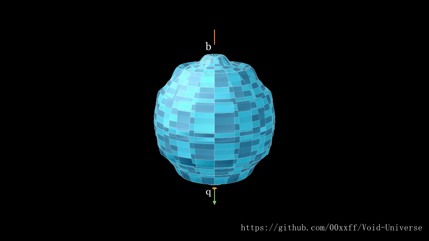

根据中微子的特点我们大致可以将其与物质核心的虚粒子联系起来，也就是命运齿轮。
再依据虚粒子所在4维空间的极性，我们可以将处于正/反4维空间中的中微子(虚粒子)定义成 正/反中微子。

所以，暂定 中微子 = 命运齿轮 = 虚粒子

对中微子在三维空间中，粒子流的出入两极，我们按其概念模型形象定义为 q 和 b 极，其中 q 极存在贯穿正反四维空间的粒子流，而 b 极仅为 三维空间流向四维空间的粒子流。

正反中微子的主体分别处在正反四维空间，这决定了中微子的手性特征。

