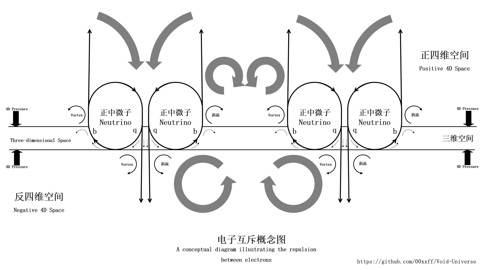

### 电场与磁场

每当我在手中握着两块强磁铁把玩，不停地快速靠近再分开，感受其中巨大的斥力和吸力的同时，双手却没有其他的感觉，我就清楚地意识到，这个世界至少是四维的。

这是推动我去探索宇宙真相的最初动力。因此，我们就从四维空间开始来分析电磁力的由来。

在宇宙的起源中，我们假设了本宇宙是被正反四维空间包裹着的。四维空间因为有了我们所处的四维零点三维空间，我们就可以将其第四维坐标分成正负两部分，我们将这两部分称为四维正负极，也就是正反极。（这是正反物质的根源）

命运齿轮的底部正好经过我们的三维空间，这使得我们所处的三维空间是特殊的，是物质宇宙得以形成和维持的根源。命运齿轮的底部波动完全在我们的三维空间，这一点非常重要，使得命运齿轮也分成了正反两种。虽然其独立存在时虚空粒子流都是一进一出自成单侧循环，但是将它们以不同的方向组合起来就会出现不同的环流结构，这是构成多种基础粒子结构的基础。而命运齿轮在三维空间转动的部分是将四维的电磁力产生的四维反作用力通过角动量变换转为三维动能矢量的关键。

如果说命运齿轮是物质的能量核心，虚空粒子是物质的血肉，那么电磁力就是支撑起血肉的筋骨。

虚空粒子由命运齿轮带动在四维空间形成的环流，是一个贯穿三维空间的正反环流结构。由于这个环流的流动方向不同，在四维空间形成了虚空粒子不同流动方向的场，即电场。我们按经典物理学中的电场方向来定义虚空粒子的极性射流在四维空间的流动方向，正电荷朝外，负电荷朝内。将命运齿轮带动的从四维负极流向四维正极的环流定义为正电场（三维朝外流向四维正极）；将从四维正极流向四维负极的环流定义为负电场（四维正极朝内流向三维）。

下面我们先尝试组装一个正宇宙的电子：
我们假设由三个在四维正极的正命运齿轮旋转方向是四维到三维的一边拼到一起（$qqq$组合），这就构成了一个三角形的稳定结构。在三角形的中心，由三个负电场环流合并成一个大的从四维正极流向四维负极的虚空粒子流，同时其中一部分虚空粒子流则跟随命运齿轮在三维空间形成对外喷射的粒子流，还有一部分则继续被命运齿轮卷入从三维空间卷回四维正极，并在四维正极与流出方向的虚空粒子流形成闭环环流。

这样，我们就得到了一个带负电荷的(正)电子$e^-$。这个电子的核心虚空粒子流是从四维负极流向四维正极，其在三维空间中的形态是从核心向外的射流，形象地说就是一个顶着三个命运齿轮的大火箭。因此，电子的这种三维形态使得它极其活跃，在被电场约束的原子空间中高速无序地运动，继而表现出电子云的特征。而当我们使用三个反命运齿轮(反中微子)以同样的方式拼到一起（$\bar{q}\bar{q}\bar{q}$组合）就可以得到一个带正电荷的(反)电子(即正电子$e^+$)。

通常情况下，原子核周围会因其自身正电荷带来的虚空粒子漩涡在其周围形成一个原子大小的球形虚空粒子涡流区，并与电子的射流达到整体的虚空粒子出入平衡。这个自循环的涡流区隔绝了外部虚空粒子流的扰动，直接限制了电子的运动范围。

接下来我们继续分析电场的相互作用：
同种电荷的相斥是因为其四维虚空粒子流向相同，所以产生了流体极性。因此，不同电荷的四维的虚空粒子流的相互作用导致粒子在四维空间产生虚空压力差，这个压力差使得粒子在四维空间中表现出同性相斥异性相吸的现象。

电流如何产生，电场的相互作用导致电子获得更多的四维动能，即轨道能级更高，这使得电子的量子形态震荡更加剧烈，直到某一刻发生了隧穿现象，自由电子从原子组成的晶格的电场束缚中挣脱并朝着电场正极移动，从而形成电流。物质束缚电子移动的能力的大小同样由介电常数来表征。

接下来我们继续分析磁场如何生成：
我们以电子运动生成磁力来举例，当电子在三维空间移动时，在正四维空间因为虚粒子流的四维部分随着电子移动，形成一个平行于三维空间的涡流带，而在反四维空间，也同样形成了一个平行于三维空间的涡流带，这个涡流带中的虚空粒子的三维动量方向与电子的动量方向一致，并且随着四维涡流做垂直于三维空间的旋转运动，我们将这个涡流的三维旋转部分想象成一个三维空间中的旋转陀螺，那么它就像是正在被四维涡流快速翻转，因此这个涡流就会产生一个垂直于三维涡流旋转方向(粒子运动方向)的进动量，这个进动量驱动周边的虚空粒子形成新的垂直于运动方向的粒子流，这个粒子流就是电子的磁场。

当其他带电粒子，在这两个涡流的范围内运动时，受这个涡流形成的局部压力梯度影响，产生轨迹偏移，这就是磁力作用。
两个磁场涡流相互靠近时，就会因为涡流的进动方向相同而产生局部低压，方向相反而产生局部低压，就形成了异性相吸同性相斥的表现。
由于磁场是一个进动涡流，所以必定存在进出两个方向，也就是磁场的两极，所以不存在磁单极子。当然如果可以人为制造更复杂的四维涡流，还是有可能造出磁单极性质的涡流的。

其他基本粒子的构成：

标准模型中粒子的自旋是对四维虚空粒子环流对称性和方向的描述。
例如：
中微子的波动是四维的，所以其旋转行为可以用单位四元数来描述，单位四元数的周期性为 720°，即需要旋转两圈才能回到初始状态。
所以中微子的自旋数为 1/2，这是由其四维波动特性和旋转行为决定的。

正反中微子的手性特征决定了由其组成的其他基本粒子也具备手性特征。

通过对正反电子概念图的分析，我们可以暂时推测基本粒子的电荷数与虚空粒子的正反四维贯穿流相关。

由此我们尝试推测其他粒子(费米子)的构成：

质子和中子，对外表现为由上夸克和下夸克组成，推测应该还存在大量的等量  $bb\bar{q}$ 和 $\bar{b}\bar{b}q$ 中微子组成的正反夸克对。
因此可以认为质子和中子都是由 $bb\bar{q}$ 和 $\bar{b}\bar{b}q$ 的正反中微子组合组成的，但质子和中子的组合不同，质子是完全均衡的组合，中子则多出3组 $bb\bar{q}$ 。

上夸克由相邻的6个中微子（2正1反 $bb\bar{q}$ + 2正1反 $bb\bar{q}$）组成（电场贯穿流2正）。

下夸克是由相邻的9个中微子（2正1反 $bb\bar{q}$ + 1正2反 $\bar{b}\bar{b}q$ + 1正2反 $\bar{b}\bar{b}q$）组成（电场贯穿流1正2负）。

由于费米子都是由中微子构成，且都具备手性，所以旋转行为同样可以用单位四元数来描述，所以自旋数为 1/2。

注：夸克主要由正反中微子的bbq组合构成，这种bbq组合会大量抽取三维空间中的虚空粒子注入四维空间，在三维空间的质量中心形成虚空负压区，进而形成三维空间外围流向质量中心的虚空粒子流，这是万有引力形成的基础。

玻色子的构成：

各种玻色子基本可以看成不同的虚空粒子涡流或在虚空粒子中传播的机械波。因此玻色子的自旋都是1或0，其手性也均由其螺旋度来描述。

上文中描述的四维流体结构都只是为了便于普通人理解而做的最简化假设，具体的四维流体可能是非常复杂的超空间形态，所以具体的理论模型还有待更多人来推导和完善。
