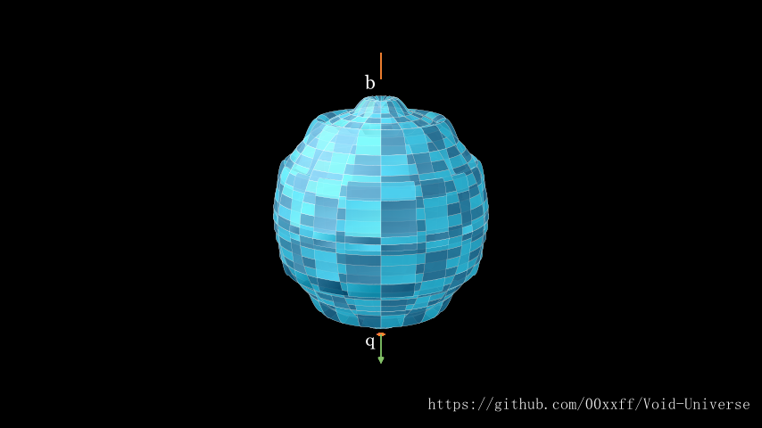
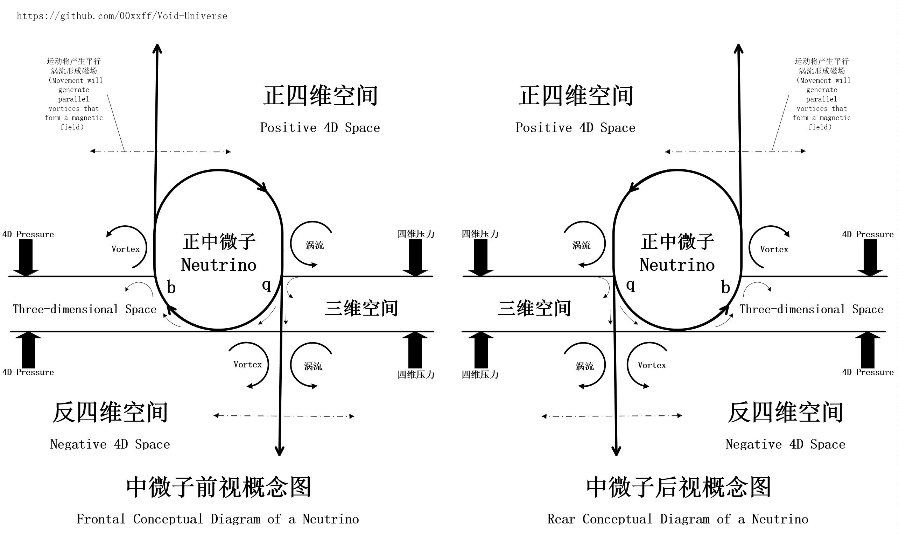
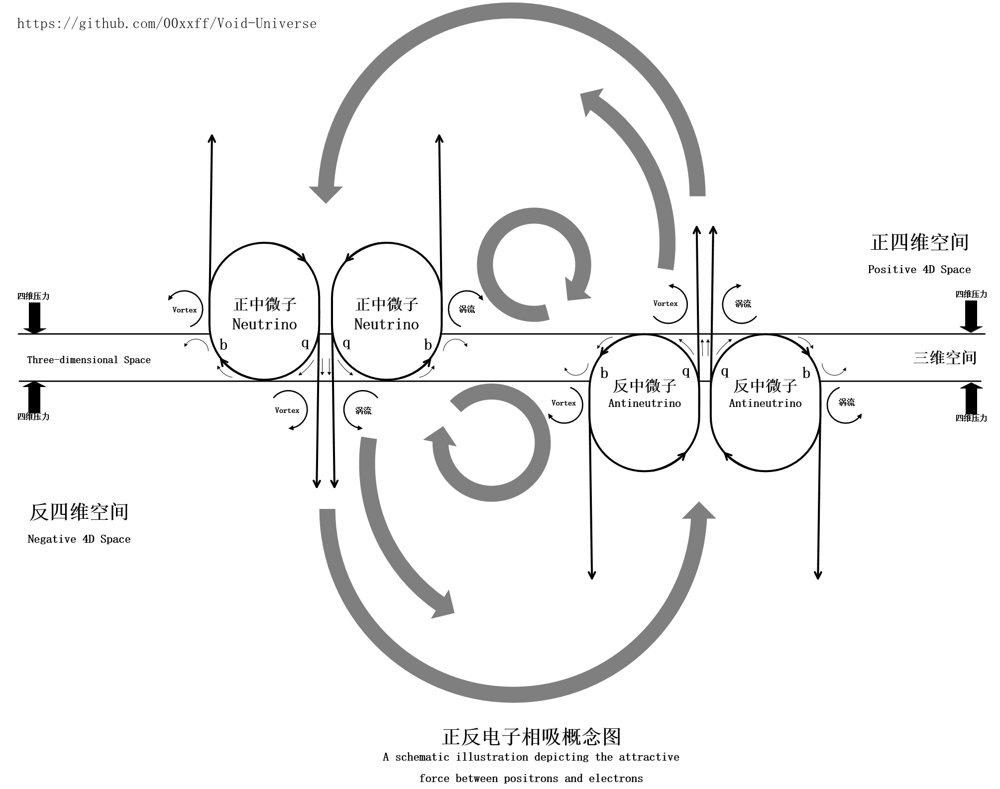
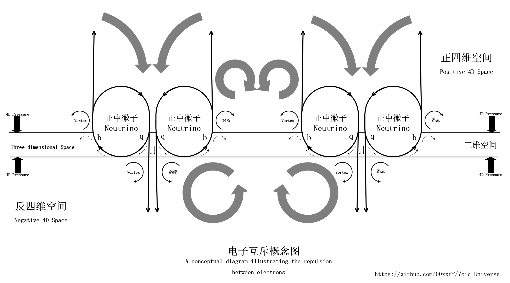
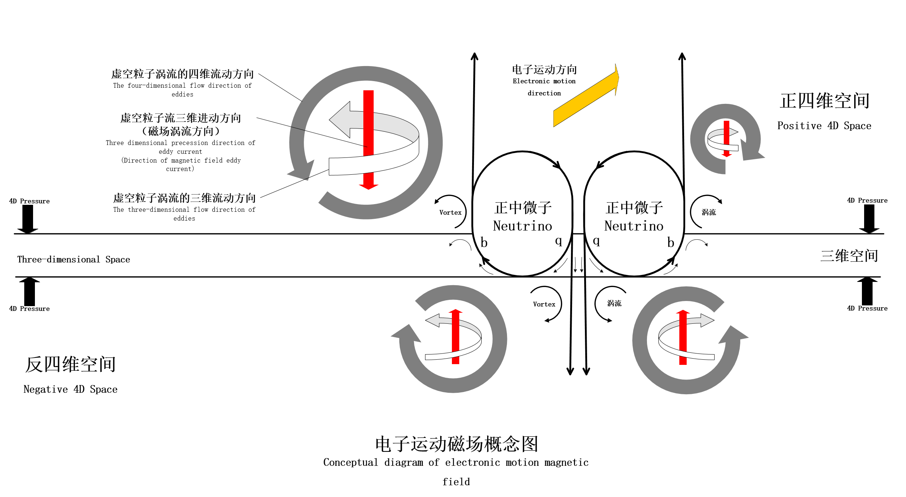

# 虚空宇宙假说

## 摘要

本文提出了一种非紧致化的四维宇宙模型，描述了一个由两种基本粒子构成的四维空间。在这一模型中，一个由四维径向压力平衡形成的三维“膜”构成了我们所感知的三维宇宙。

该模型原理通俗易懂，通过将基本粒子基态的零点能、原子核的核能、宇宙膨胀的暗能量这些现有理论无法解释的巨大能量来源都归结到一种更基础的基本粒子上，并与另一种极小尺度的可以传递能量的基本粒子共同组成了一个可以用量子力学、热力学和流体力学描述的四维物理框架，在这个框架内，我们可以自然的解释许多之前难以理解的宏观及微观物理现象，包括但不限于以下内容：

- **微观层面**：中微子与电子的特性、基本粒子的构成、手性来源、正反物质的形成以及核能的来源。
- **天文学方面**：宇宙膨胀、暗物质、暗能量、星系动力学问题及宇宙大尺度结构的形成机制。
- **基本力的本质**：万有引力、电磁力、强相互作用和弱相互作用的形成过程及其作用机理。
- **量子力学现象**：量子隧穿效应、量子纠缠现象等。
- **光与电磁波**：光的产生、传播、偏振、波粒二象性，以及单缝和双缝实验的结果。
- **相对论效应**：狭义相对论和广义相对论中的时间膨胀、质量增加、引力透镜等现象。
- **其他现象**：黑洞视界与喷流的形成、引力波、量子纠缠时间、希格斯玻色子的质量来源、对称性破缺和宇称不守恒问题。

注意：阅读本文须彻底摒弃“投影”概念，将三维膜视为四维空间的真实子集，其物理完全由四维流体动力学驱动。

---

## 正文

### 1. 引言

传统高维理论（如弦理论、卡鲁扎-克莱因理论）通常依赖于紧致化来隐藏额外维度，从而解释我们为何只观测到四维时空。然而，这些方法需要引入复杂的几何结构（如卡-丘流形），并难以直接与实验观测联系起来。本文提出了一种全新的非紧致化四维空间理论，通过流体动力学和压力平衡机制自然实现了自由度受限的过程。该模型不仅避免了复杂的几何约束，还能够统一解释引力、量子现象、宇宙膨胀等多种物理现象。

### 2. 宇宙起源

在一个充满极小尺度 B 粒子的四维空间中，存在大量 A 粒子。这些 A 粒子表面具有永不停歇的光速循环波动。这种波动不仅驱动周围的 B 粒子形成瞬态涡流，还持续创造新的 B 粒子。由于 A 粒子不断注入能量，整个四维空间形成了一个相对稳定的空间背景压力。在这种背景压力以及 A 粒子周围涡流梯度压力的作用下，大量 A 粒子开始聚集，导致四维空间中出现不均衡的压力分布。

当 A 粒子聚集到一定规模时，两个 B 粒子压力集团的边界发生碰撞，在中间形成了一层四维动量方向压力平衡的三维“膜”。这层“膜”就是我们所处的三维宇宙。

随后，大量 A 粒子与“膜”发生碰撞，并在双向压力的影响下依附在其两侧，逐渐聚集。由于 A 粒子的存在，“膜”的两侧产生了大量 B 粒子涡流，为“膜”的长期稳定提供了必要的压力和保护。同时，A 粒子还驱动大量 B 粒子流在“膜”两侧来回穿越，形成环流，A粒子之间通过流体动力学作用相互结合形成了各种复杂的复合粒子，最终构建了一个稳定的宇宙系统结构。

为了便于理解，我们在现有理论中找到与这两种粒子特性相近的概念，将A粒子的三维形态称为“中微子”，B粒子的三维形态称为“以太”。
在四维空间中，我们将它们的四维形态分别重新命名为“虚粒子”和“虚空粒子”。(注：非量子力学中的相关概念)

- **虚空粒子（以太）**：具有一定的刚性和弹性，表现出空间不相容性，且尺度极小，可视为构成空间的基本单位。
- **虚粒子（中微子）**：表面具有永不休止的高频波动，是自然法则的根源之一。

注：关于以太是否存在，将在后续章节（迈克尔逊-莫雷实验分析）中进一步探讨。
虚粒子、虚空粒子的来源、虚粒子的永动特性，属于扩展部分-宇宙降维假说，虚粒子波动能量来自自身的其他维度，在此不展开描述。

本假说的三大基本设定包括：

1. 四维的“宇宙”；
2. 四维的“以太”；
3. 永动的“中微子”。

这些设定遵循简单性原则，仅针对标准模型和大爆炸理论无法解释的部分，不引入任何额外实体。

此外，“涡流”和“环流”是由流体速度梯度引起的局部压力差驱动的瞬态粒子流（以太流）。一旦失去压力差，这些流动将迅速消失。因此，虚粒子（中微子）永动的能量输出维持了整个四维空间的压力，并不违背能量守恒定律。

---

### 3. 基本粒子的形成

虚粒子（中微子）通过流体力学相互作用结合成更复杂的系统结构。我们假设中微子的四维形态是一个表面具有光速波动的类超球体，当其浸入到三维膜中，其三维形态就表现为表面具有光速波动的非平凡的拓扑球体。其表面波动从四维经过三维再回到四维，因此在三维空间中可以观察到中微子的两极：一极是表面波带着粒子流凭空出现的位置，另一极是表面波带着粒子流凭空消失的位置。这种波动还会驱动周边的虚空粒子形成高速涡流，并伴随部分跨维度粒子流的出现与消失。

为了准确描述中微子的自转方向（表面波运动方向）和形态，我们将其中的一极定义为“ $b$ 极”，另一极定义为“ $q$ 极”：

* **$q$ 极** ：代表正反四维贯穿粒子流；
* **$b$ 极** ：代表三维流向四维的单向粒子流。

中微子在三维空间中的自转方向是从 $q$ 极到 $b$ 极。

由于中微子的三维形态的半剖面形象类似一个高速旋转的齿轮，又是虚空压力以及所有物理现象的根源，同时还是宇宙形成的关键因素，我们将这个形态形象地称为“命运齿轮”，意为宇宙万物的命运所在。
通过对这个概念图的流体力学分析，可以推断 $q$ 极的贯穿流是粒子组合的核心所在。所有粒子稳定组合应至少包含一个 $q$ 极主导的贯穿流，而 $q$ 极的方向和数量决定了组成粒子的电荷类型和数量。
假设中微子的 $q$ 极代表 $-\frac{1}{3}e$ 电荷的四维通量，反中微子的 $\bar{q}$ 极代表 $+\frac{1}{3}e$ 电荷的四维通量。

基本粒子可以这样解释：

* **电子** ：由3个中微子组成，组合方式为 $qqq$，带 $-1e$ 电荷；
* **正电子（反电子）** ：由3个反中微子组成，组合方式为$\bar{q}\bar{q}\bar{q}$，带 $+1e$ 电荷；
* **上夸克** ：由6个中微子（4正2反）组成，组合方式为2正1反 $bb\bar{q}$ + 2正1反 $bb\bar{q}$，带 $+\frac{2}{3}e$ 电荷；
* **下夸克** ：由9个中微子（4正5反）组成，组合方式为2正1反 $bb\bar{q}$ + 1正2反 $\bar{b}\bar{b}q$ + 1正2反 $\bar{b}\bar{b}q$，带  $-\frac{1}{3}e$ 电荷。
* **质子**：对外表现为由2个上夸克和1个下夸克组成，推测应该还存在大量的等量  $bb\bar{q}$ 和 $\bar{b}\bar{b}q$ 中微子组成的正反夸克对。
* **中子**：对外表现为由1个上夸克和2个下夸克组成，推测应该是由大量的等量  $bb\bar{q}$ 和 $\bar{b}\bar{b}q$ 正反夸克对组成。

我们知道在化学中，存在**共价键**，即原子可以通过相互共享电子结合成稳定的分子，所以同理，中微子的两极应该也能通过互补共享结合成更复杂的结构。
所以上夸克的拓扑连接我们可以压缩成4个中微子实现 $\bar{q}bb\bar{q}$，下夸克可以压缩成5个中微子实现$q\bar{b}\bar{b}q+\bar{q}$，而π 介子（π⁺）完全可以写成 $\bar{q}bb\bar{q} + \bar{b}\bar{q}$，这样 $\pi^+ \rightarrow \mu^+ + \nu_\mu$ 就可以写成 $\bar{q}bb\bar{q}\bar{b}\bar{q} \rightarrow \bar{q}b\bar{q}\bar{b}\bar{q} + b$， $\mu^+ \rightarrow e^+ + \nu_e + \bar{\nu}_\mu$ 就是 $\bar{q}b\bar{q}\bar{b}\bar{q} \rightarrow \bar{q}\bar{q}\bar{q} + b + \bar{b}$。
（以上基本靠猜，如有雷同纯属巧合）

标准模型中粒子的自旋，在本模型中可以用四维虚空粒子环流对称性和方向来描述。
中微子具有非平凡的四维拓扑结构，所以其旋转行为可以用单位四元数来描述，单位四元数的周期性为 720°，即需要旋转两圈才能回到初始状态。所以中微子的自旋数为 1/2，这是由其四维拓扑结构决定的。
正反中微子因为其四维结构只存在于正/反四维空间的一侧，所以中微子表现出了手性特征，而由非对称的正反中微子组成的其他基本粒子自然也具备不同的手性特征。
正反中微子、电子由于仅由四维单侧的中微子组成，所以它们会处于一种高频的四维振荡状态，这使得它们在三维空间极其活跃，并且可以表现出隧穿现象（即凭空消失从四维空间移动绕过三维的势垒或障碍物然后再凭空出现）。
而其他重子则由正反中微子混合结构组成，所以它们会被牢牢锁定在三维“膜”上，并且这种结构如同黑洞一般不停地抽取三维空间中的虚空粒子注入四维空间，这也是质量的来源以及万有引力形成的基础。
在本模型中，基本粒子的质量可以用重整化群流来描述，相对性质量也同理（详见下文相对论效应章节）。即质量来源于命运齿轮带动的四维环流的总动能，而不同粒子的质量差异可以直接归因于它们的命运齿轮数量、结合方式（拓扑结构）及其驱动的环流复杂性。（通过狭义相对论的相对性质量公式我们可以简单推导出命运齿轮驱动的虚空粒子流速度约为 $0.866c$）

到这里，反物质也很好理解了吧，为什么核能如此巨大也很好理解了吧，为什么正反物质会湮灭并释放出大量光子也很好理解了吧。

### 4. 基本力的形成

* **电磁力** ：带电粒子的贯穿流导致的涡流梯度压力形成了静电力，带电粒子做三维运动产生的平行三维涡流被四维翻转因角动量守恒导致的三维垂直进动涡流形成了磁场；（下列概念图中，电场请用四维压力场来解读，磁场请用四维流速场来解读）
  
  
  
* **强相互作用力** ：由粒子周边的三维涡流作用力形成；
* **弱相互作用力** ：由粒子周边的四维不稳态涡流作用形成；
* **万有引力** ：由三维空间的虚空压力梯度以及四维的虚空粒子引力环流共同作用形成。

由于正反四维空间的压力，无数的虚空粒子时刻都在侵入三维空间(三维"膜")中，形成均匀的三维扩张压力，这就是三维空间的虚空背景压力。
在质量系统附近，虚空粒子在四维空间中的密度分布呈超球体状，从中心向外逐渐减少；因此，在三维空间中围绕质量中心形成了由外向内递增的球形“增量”压力梯度。

三维空间中的物质主要由大量的 $ bbq $ 中微子复合结构组成，这些结构会不断抽取虚空粒子流入四维空间，从而在质量中心形成低压区。在三维虚空背景压力和增量压力的共同作用下，形成了由外至内的压力梯度和指向质量中心的虚空粒子流。我们将这种跨四维和三维的超长程虚空粒子环流称为“虚空粒子引力环流”

我们将三维空间中这个球形的虚空粒子流动区域称为物质的虚空球引力区，而在虚空球引力区边界之外，虚空粒子增量压力逐步递减直至等于虚空背景压力，这个球形区域就是物质的虚空球，我们将物质虚空球边界到虚空球引力区边界之间的部分称为虚空球的斥力区。

当两个质量系统的虚空球引力区相互重叠时，就会产生局部压力差，在虚空背景压力的推动下，产生了引力现象。
而当一个较小的质量系统完全位于较大质量系统的虚空球引力区内部时，其受到的引力主要由该区域的虚空粒子流和虚空粒子增量压力形成的梯度压力共同决定。

当一个超大质量的系统处于主导地位时，其他小质量物体受到的引力主要源自该系统的虚空粒子引力环流产生的空间塌陷效应，即重力加速度，也就是在这个引力场范围内无论物体质量大小、体积大小，其在相同位置的受到的重力加速度是相同的，就是该位置的四维渗透粒子流速度（空间塌陷加速度），就如同帆船被横风吹动加速一样，这里的重力加速度是由虚空粒子的四维径向流速推动的。所以这里不是因为引力产生了加速度，而是因为先有了加速度才产生了相应的力，即先有了加速度，然后才有了"引力"，这是因为在我们的认知当中，物体速度发生变化一定是受到了外力的作用，所以我们将这个假想的“作用力”称为引力，根据牛顿第二定律 F=ma 计算就得到了万有引力。

图中引力环流内任意四维径向流向三维膜的虚空粒子流速与该位置的三维虚空粒子流速相等，等于该位置的引力加速度值。
我们可以做出这样一个推断：在星球/星系引力场中任意一点的虚空粒子流速等于该点的引力加速度值，虚空粒子流方向等于引力加速度方向。
现在我们计算一下地球同步轨道与地球表面之间的引力红移量，将引力加速度值代入得到光在地球引力场虚空粒子流中传播的红移公式为 $\frac{\Delta \nu}{\nu} = -\frac{GM}{c^2} \left( \frac{1}{r_{\text{sync}}} - \frac{1}{R_E} \right)$ ，这与广义相对论的引力红移公式完全一致，或者说我们可以根据广义相对论的引力红移公式推导出地球引力场内任意一点的虚空粒子流速等于该点的重力加速度值。而当我们使用引力环流中虚空粒子流速来计算引力效应导致的时间延迟时，同样可以得到与广义相对论相同的时间延迟公式 $\Delta t_{\text{delay}} = \frac{GM}{c^2} \left( \frac{1}{R_E} - \frac{1}{r_{\text{sync}}} \right)$ ，所以由此可以表明虚空粒子引力环流模型完全可以作为广义相对论中时空弯曲效应的一种等效解释。

星系动力学问题也可以直接理解为星系旋转实际上是整个虚空粒子集团在旋转，即空间在旋转，与其中的星体质量无关，所以星系旋转形态只与空间旋转形态有关，所以不需要额外引入暗能量和暗物质来提供额外的“引力”。

宇宙星体之间的引力势能主要是由虚空压力梯度决定的，当两个大质量物体因万有引力相互吸引靠近，并获得动能时，物体因万有引力而获得的动能是由虚空压力提供的，与物体本身的能量无关，两个物体均未损失任何的能量，它们多出来的动能是由虚空压力提供的，也就是来自中微子的零点能。

---

### 5. 光与电磁波

在本模型中，光可以解释为三维膜上的界面波。三维膜两侧平衡的四维背景压力为界面波的形成和传播提供了均匀恒定的回复力，就好比一个理想的弹簧子在两个夹板中间弹射前进，这里弹簧子表示光子的传播依靠的是虚空粒子的弹性（压缩和稀疏）机制，两个夹板则比喻光子波包四维波动方向上遇到的压缩屏障（类比声障）。

由于光是三维膜上的界面波，所以光子的波峰和波谷都在四维空间，只有中间部分存在于三维膜中，因此从三维空间观察，光表现为一段段跳跃前进的光量子。光的传播速度由波的传播介质（即虚空粒子的密度）决定，因此是恒定的。

光和电磁波的生成并非连续单一的过程，而是由虚粒子与虚空粒子流相互作用在三维膜上产生的群体界面碰撞事件产生，这使得光和电磁波表现为离散的群体波，这种离散的性质使得单个光量子表现出粒子特性。同时，在产生光子的事件源头，事件发生的频率与光子波动的频率一致，这样就导致光子集群形成了与单个光子频率一致的概率波。因为光子集群与光子的速度相同，所以这个概率波的速度和波长也和光子相同。

综上所述：

- 单个光子既是一个四维界面波，又是一个在三维空间跳跃前进的量子团，这是光子的波粒二象性。
- 光是由大量光子组成的集群，这个光子集群在三维空间中的传播行为会表现出与单个光子的波长和频率一致的概率波，这是光在三维空间中的波粒二象性。
- 光的衍射和干涉实际上是由光的概率波导致的。由于光子同样具有波动性，单光子同样可以出现衍射现象，而多个单光子随机出现就会表现出概率波的特性。这也是单光子通过双缝依旧可以出现概率波的干涉图案的原因。
- 当在光路中施加影响对光子进行探测以确定其经过了哪条缝隙时，光子的概率波特性就会消失。这也是单光子双缝实验中，当光子被探测时，干涉图案消失的原因。
- 光子的波峰和波谷都在四维空间，与同在四维空间产生作用的电磁场可以相互影响是很正常的，这也合理地解释了光的偏振现象。

#### 物质波

同样的原理，物质波也很容易理解了，当电子在四维径向方向上振荡时，电子的行为在三维空间中就可以用波函数表示，这种振荡使得电子可以表现出与光子类似的波粒二象性。

#### 热力学本质

物体的温度反映了其内部所有粒子的四维径向波动强度（频率）。
热传导就是分子和原子通过静电力(四维梯度压力)和范德华力(电子运动导致的局部动态梯度压力)以及热辐射实现四维径向波动的共振和能量传递。
热辐射就是分子和原子的四维径向振荡在三维膜上产生界面波（如光、红外线、电磁波）。
热辐射升温机制就是当物体吸收光子的能量时，由于频率共振，其分子和原子的振荡频率增加，从而导致温度升高。

##### 热力波

* 在物质内部，热传导可能还依赖于一种短程的热辐射-“热力波”。
* 这种“热力波”是由粒子在四维径向方向振荡与三维膜往复碰撞产生的。
* “热力波”是一种三维膜上的界面波，其传播依赖于：
  * 三维膜两侧的四维虚空压力提供的回复力；
  * 虚空粒子剪切变形产生的粘性。
* 热力波与电磁波的区别可以类比水波与声波。

#### 光子的形态

光的偏振说明光子存在三维性状，即光子具备不同的波包形态。

光和电磁波并不是连续的线性波，而是一开始就是由离散的独立波包组成的独立波，光子的产生是源于三维膜界面处发生的高速(可能是超光速)碰撞事件，比如两个反向涡流的碰撞或命运齿轮的表面波与界面的碰撞，所以这个四维波的波包形态是由撞击事件的主体和撞击过程决定；
电磁波在虚空粒子中只能靠弹性(压缩和稀疏)传播，所以光子的能量波包就如同一团超光速的量子团在四维的两个压力层中来回反弹，这构成了光子在三维空间中的波函数表现；
撞击的速度越快，能量越大，超光速的量子团的速度也越快，反弹的频率也就越快，即光子的频率越高、波长越短；
所以在三维空间中，光子是一个按固定波长频率跳跃前进的曲面，可以是圆、椭圆、甚至是扁形或其他扭曲的形态，这个曲面仅仅是光子的四维波包在三维空间中的切面，这个切面上各个点的三维、四维动能矢量方向各不相同，在四维空间中就表现为磁场矢量和电场矢量。

光在真空中传播速度是恒定的，没有色散效应，当光在物质介质中（如空气、水、玻璃等）传播时，由于物质原子、分子周边的虚空粒子密度急剧变化，会导致色散效应，即波长越长的光子，越容易跨越原子、分子附近的高密度区，而显得速度更快，而波长越短的光，则会更多的陷入原子、分子附近的高密度陷阱中，速度就会显得更慢。

#### 光子的纠缠

在本模型中，纠缠光子就是同一次碰撞事件中分裂出来的两个光子，它们的纠缠特性就表现在四维波包的形态、能量、以及方向上。
比如偏振纠缠和路径纠缠可以由光子的波包形态决定，而时间-能量纠缠则可能由分裂的先后顺序产生，空间模式纠缠和动量纠缠更可能由撞击主体的形态和动量方向决定。
由于这些碰撞事件在复现时，以人类的观测尺度，其相似度达到99.999%以上，我们基本可以认为其分裂模式保持不变，所以由这类碰撞事件产生的分裂光子就被定义为纠缠光子，因为它们在产生的那一刻起，它们注定了只有两种状态，所以无论何时何地当我们测量确定其中一个光子的状态后，就可以知道另一个光子状态，这是从它们产生的源头就已经确定的了，而不确定性原理和量子坍缩在这里更多的只是一个哲学问题。（贝尔不等式问题见后文分析）

---

### 6. 相对论效应

* 在本模型中，整个宇宙都是动态平衡的三维"膜"，虚空无时无刻都在膨胀，所有的质量系统都是在相对运动中，四大基本力的形成机制与质量系统的整体惯性状态无关，所以物理定律在所有惯性系中都是相同的。
* 在本模型中，真空中的光速是一个常数，这是由真空中虚空粒子密度决定的，所以光速不变。而不同参考系中的光速测定，就涉及到一个测量方式的问题，假如我们在一个密闭的真空容器中测量光速(排除引力效应的影响)，那么我们在任何惯性参考系下测到的光速都是相同的。而我们常规意义上所指的惯性参考系，都符合这种密闭情形，比如在飞船的舱室里，比如在行星密闭的引力场环境中，在这些“封闭的”惯性参考系内部，光速只跟虚空粒子密度有关，跟整个参考系的惯性运动状态无关。
  以上两点满足狭义相对论中的狭义相对性原理和光速不变原理，所以本模型是兼容狭义相对论的（即可以推导出狭义相对论相关公式）。
  但是，本模型认为我们完全可以在不引入额外的时间维度的情况下，使用相对空间位移来推导出洛伦兹变换公式，时间只是推导过程的一个中间变量。

对于狭义相对论中根据时间变换推导出的一些特殊物理现象，我们可以做如下解释：
在本模型中，狭义相对论效应（时间膨胀、质量增加、长度收缩）主要适用于**微观粒子的高能实验结果**，而不是直接适用于宏观质量系统。这些效应可以通过微观粒子核心处的虚粒子（命运齿轮）和虚空粒子流的动力学特性来解释。以下是对每种效应的具体分析：

#### **时间膨胀**

- **现象描述**：在高能实验中，不稳定粒子（如μ子）的寿命会随着速度的增加而延长。
- **机制解释**：
  - 在本模型中，时间膨胀的根本原因是**虚空粒子流密度的变化**对粒子系统稳定性的影响。
  - 当一个微观粒子以高速运动时，其核心处的命运齿轮会迎面撞上更多的虚空粒子，导致其周围的虚空粒子流密度显著增加。
  - 这种密度增加使得命运齿轮周围的虚空粒子涡流更加稳定，从而延缓了不稳定粒子结构的崩塌过程。换句话说，更高的虚空粒子密度提供了更强的外部压力，维持了粒子系统的平衡状态更长时间。
  - 因此，从外部观察者的角度来看，粒子的寿命延长，表现为时间膨胀。

#### **质量增加**

- **现象描述**：在高能实验中，微观粒子的质量会随着速度的增加而增大。当速度达到 $v = 0.866c$ 时，粒子的相对性质量约为静止质量的两倍。
- **机制解释**：
  - 在本模型中，基本粒子的质量来源于其核心“命运齿轮”驱动的四维虚空粒子环流的总动能。不同粒子的质量差异可以归因于它们的命运齿轮数量、结合方式（拓扑结构）以及驱动的环流复杂性。
  - 当一个微观粒子以高速运动时，其核心处的命运齿轮会迎面撞上更多的虚空粒子。这些虚空粒子在三维空间和四维空间中形成新的流体系统，方向与粒子的运动方向一致。这种新增加的虚空粒子流可以被视为一种“动态附加环流”，它叠加在粒子原本的四维环流之上。
  - 根据重整化群流理论，粒子的总质量是其所有环流（包括原本的静态环流和新增的动态环流）的动能贡献的总和。随着粒子速度的增加，动态附加环流的强度逐渐增强，导致总动能增加。
  - 当粒子的速度达到 $v = 0.866c$ 时，动态附加环流的速度等于命运齿轮原有的四维环流速度。此时，粒子的总环流动能翻倍，表现为质量增加一倍。
  - 这种质量增加的本质可以通过重整化群流的演化来理解：随着速度的提升，粒子系统的有效能量尺度发生变化，虚空粒子环流的分布和强度随之调整，从而导致质量的相对性变化。
  - 需要注意的是，这种质量增加仅适用于微观粒子，不能简单地推广到宏观质量系统。

#### **长度收缩**

- **现象描述**：在高能实验中，微观粒子在运动方向上的有效碰撞截面会随着速度的增加而减小。
- **机制解释**：
  - 在本模型中，长度收缩的效应可以归因于**运动方向上的虚空粒子流影响范围被压缩**。
  - 当一个微观粒子以高速运动时，其核心处的命运齿轮在运动方向上会受到更强的虚空粒子冲击。这种冲击导致命运齿轮在运动方向上的虚空粒子流范围被压缩。
  - 这种压缩效应直接影响了粒子的碰撞截面，使其在运动方向上的有效尺寸变小。从实验观测的角度来看，这表现为长度收缩。
  - 同样，这种效应仅适用于微观粒子，不能直接应用于宏观物体。

#### **宏观质量系统的特殊性**

- 在本模型中，狭义相对论效应（时间膨胀、质量增加、长度收缩）主要是针对**微观粒子高能实验结果**的解释，而不是普遍适用于所有物理系统。
- 对于**宏观质量系统**，其内部由大量微观粒子组成，这些粒子之间的相互作用和整体结构可能屏蔽或削弱了单个粒子的相对论效应。因此，宏观质量系统在高速运动时可能不会表现出与微观粒子相同的相对论效应。
- 例如：
  - 宏观物体的时间流逝是否受相对论效应影响，取决于其内部微观粒子的平均行为以及整体系统的动力学特性。
  - 宏观物体的质量变化和长度收缩可能需要更复杂的分析，尤其是涉及引力场和虚空球的动态影响。

#### **广义相对论的解释**

- 广义相对论中的时间膨胀和引力红移现象同样可以通过虚空粒子的流动和密度变化来解释：
  - 在强引力场中，虚空粒子的密度显著增加，导致命运齿轮周围的虚空粒子涡流更加稳定，从而延长了不稳定粒子的寿命（时间膨胀）。
  - 引力场中的光路偏折和黑洞视界现象则与虚空粒子流的方向和速度分布密切相关。
  - 使用引力加速度值推导出的虚空粒子流红移公式与广义相对论的引力红移公式一致，说明在非极端情况下引力红移现象可以直接用虚空粒子引力环流来解释。

#### **质量-能量等价**

- 在本模型中，质量和能量的本质统一归因于虚粒子及其驱动的虚空粒子流的总动能和拓扑结构。
- 虚空粒子流的总动能决定了系统的内在能量，而拓扑结构则决定了系统与外界的耦合度以及能量交换方式和交换效率。
- 质能等价关系 $E = mc^2$ 的本质在于虚粒子波动能量通过驱动四维虚空粒子环流转化为动能，并进一步表现为质量或能量。
- 质能转换的过程本质上是虚空粒子环流的动态调整和重新分配，体现了宇宙中能量守恒的基本规律。

#### 洛伦兹变换的自然涌现

在本模型中，洛伦兹变换可以视为四维流速 $ v^A $ 的对称性自然涌现的结果，而无需引入独立的时间维度。具体而言，洛伦兹变换的核心在于描述不同惯性参考系之间的时空关系，其数学形式反映了光速不变性和相对性原理。在传统狭义相对论中，时间被视为一个独立的第四维度，与空间维度共同构成四维时空。然而，在本模型中，时间和空间的关系可以通过四维流体动力学（即虚空粒子流的动态特性）来重新解释。

- **四维流速 $ v^A $**：在本模型中，所有物理现象都可以归结为虚粒子和虚空粒子流的动力学行为。四维流速 $ v^A $ 描述了虚空粒子流在四维空间中的运动状态。
- **对称性**：由于虚空粒子流的分布和运动具有对称性（例如各向同性和均匀性），这种对称性直接导致了洛伦兹变换的数学形式。

因此，在本模型中，洛伦兹变换可以被理解为四维虚空粒子流对称性的体现，而不需要将时间视为一个独立的维度。

---

### 7. 迈克尔逊-莫雷实验

#### **1. 背景与传统解释**

迈克尔逊-莫雷实验旨在检测“以太风”的存在，即光波传播介质相对于地球的运动。然而，实验结果表明，无论地球的运动状态如何，光速在不同方向上始终保持恒定。这一结果否定了经典以太假说，并为狭义相对论的提出奠定了基础。

然而，在本模型中，“以太”被重新定义为**虚空粒子**，这是光和电磁波的传播介质。虚空粒子具有动态流动特性，其行为受到引力场的影响。因此，我们需要结合地球引力场内虚空粒子流的特性，重新分析迈克尔逊-莫雷实验的结果。

**直接说结论：在本模型中“以太风”对应虚空粒子流，而在地球上虚空粒子流即引力场的引力环流，所以这个虚空粒子流对光线的影响即引力场对光线的影响，对应广义相对论的引力透镜效应，同时由于地球周边引力场分布是均匀的，所以地球周边的虚空粒子流分布也是均匀的，所以迈克尔逊-莫雷实验(包括现代的高精度实验)无法得到引力效应以外的结果，即(排除引力效应后)地球周边光速表现为各向同性。**

#### **2. 地球引力场中的虚空粒子流特性**

根据本模型中对万有引力本质的推导：

- 在地球引力场内，虚空粒子从外部空间流向地心，形成一个球形的虚空粒子流(引力环流的三维空间部分)。
- 引力场中任意一点的虚空粒子流速度值等于该点的重力加速度值，方向指向地心。
  - 例如，在地球表面，虚空粒子流的速度约为 $g = 9.8 \, \text{m/s}$，方向垂直向下。
- 这种虚空粒子流是由四维空间向三维空间侵入的引力环流驱动的，并且在整个引力场范围内均匀分布。

因此，在地球表面附近，虚空粒子流的主要特征是：

1. **方向性**：虚空粒子流的方向始终指向地心，而不是随地球的公转或自转而改变。
2. **速度值**：虚空粒子流的速度较低（约 $9.8 \, \text{m/s}$），远小于光速（$c \approx 3 \times 10^8 \, \text{m/s}$）。
3. **相对静止性**：由于虚空粒子流与地球引力场同步旋转，地球表面附近的虚空粒子流在其他方向上与地球保持相对静止。

#### **3. 迈克尔逊-莫雷实验的重新分析**

基于上述特性，我们可以重新分析迈克尔逊-莫雷实验的结果。

##### **(1) 实验设计与预期**

迈克尔逊-莫雷实验的核心假设是：如果存在“以太风”，则光在不同方向上的传播速度会因地球相对于“以太”的运动而发生变化。实验通过干涉仪测量两束光的相位差，试图检测这种速度差异。

在传统以太假说中，“以太”被视为一种刚性、静态的介质，地球在其内部运动时会产生“以太风”。然而，在本模型中：

- 虚空粒子流的方向始终指向地心，而非随地球公转或自转而变化。
- 垂直方向的虚空粒子流的速度极低（约 $9.8 \, \text{m/s}$），远小于光速，因此对光速的影响可以忽略不计。
- 地球表面附近其他方向的虚空粒子流与地球保持相对静止，这意味着地球表面不存在显著的“以太风”。

##### **(2) 实验结果的解释**

根据本模型理论，迈克尔逊-莫雷实验未能检测到“以太风”的原因如下：

1. **虚空粒子流的低速特性**：

   - 在地球表面，虚空粒子流的速度仅为 $9.8 \, \text{m/s}$，这与光速相比微不足道，因此对光的相位影响可以忽略，远远低于迈克尔逊-莫雷实验的实验精度。
   - 光的传播速度主要由虚空粒子的密度决定，而虚空粒子的密度在地球表面相对均匀，导致光速在不同方向上保持恒定。
2. **虚空粒子流的相对静止性**：

   - 地球表面附近的虚空粒子流与地球同步旋转，因此在地球参考系内，虚空粒子流表现为相对静止。
   - 这意味着地球表面不存在显著的“以太风”，从而解释了迈克尔逊-莫雷实验中未观察到干涉条纹变化的现象。
3. **引力场的屏蔽效应**：

   - 地球引力场内的虚空粒子流形成了一个稳定的球形结构，屏蔽了外部虚空粒子流的扰动。
   - 因此，地球表面的虚空粒子流不会受到地球公转或太阳系运动的影响，进一步保证了光速的各向同性。

##### **(3) 实验局限性**

迈克尔逊-莫雷实验的设计基于以下假设：

- “以太”是一种刚性、静态的介质。
- 地球相对于“以太”的运动会产生显著的“以太风”。

然而，在本模型中：

- 虚空粒子是动态的、非刚性的介质(有密度变化)。
- 地球表面附近垂直方向的虚空粒子流速度极低，且其他方向与地球自转保持相对静止。

因此，迈克尔逊-莫雷实验实际上并未否定光需要介质传播的假设，而只是否定了静止“以太”的假设。

#### **4. 结论**

在本模型中，迈克尔逊-莫雷实验未能检测到“以太风”的原因可以归结为以下几点：

1. 地球引力场内垂直方向的虚空粒子流速度极低（约 $9.8 \, \text{m/s}$），远远低于迈克尔逊-莫雷实验的实验精度。
2. 地球表面附近其他方向的虚空粒子与地球保持相对静止，导致地球参考系内不存在显著的“以太风”。
3. 地球引力场屏蔽了外部虚空粒子流的扰动，确保了光速的各向同性。

---

### 8. 其他物理现象的解释和推测

#### 黑洞

黑洞引力场的引力环流速度极快，在接近黑洞表面时虚空粒子流速度接近甚至超过光速。在这种极端条件下，黑洞中心形成了一个超光速的虚空粒子漩涡，阻止了光子从黑洞内部逃逸，从而形成了黑洞视界。

当黑洞自身高速旋转时，在黑洞的两极区域，由于旋转效应，可能会形成低速旋涡区。这些区域的虚空粒子流速度较低，允许部分高能射线从中逃逸，形成黑洞喷流。

在黑洞中心，巨大的引力环流速度和压力可能会撕裂基本粒子结构，释放出大量的自由正反中微子，这些正反中微子又被引力环流带入四维空间中，因此黑洞的四维空间部分可能更接近于宇宙成型初期的状态。这些正反中微子又随着黑洞的引力环流，重新进入三维膜，出现在黑洞周边的三维空间中，同时一部分自由的正反中微子可能会相互靠近组合成 电子 和 正电子，因此我们有理由认为黑洞周边的虚空中应该有着着密度超过宇宙其他部分的 正反中微子、电子、正电子分布，同时还伴随着大量的电子与正电子的湮灭事件。

#### 引力波

推测其一：引力波是由大质量天体（如双黑洞系统）的高速碰撞引起的三维膜的震动产生的超级界面波。当两个大质量天体相互绕转并最终合并时，它们周围的虚空粒子流会发生剧烈碰撞，产生超级界面波并以光速向外传播。我们将这个超级界面波的波包视为一个超大的光子，借用刘慈欣小说中宏电子的创意，我们可以将引力波的波包视为一个“宏光子”，这个宏光子的传播机制和光子一样，所以其同样具有偏振属性，其偏振属性在三维膜中的表现就是会导致其经过区域的虚空粒子密度分布呈现出与其偏振形态的弹性结构一致的周期性变化。而这种密度变化会导致光线在经过这些不同密度区域时产生速度差（即相位差），所以就产生了引力波探测实验中的干涉现象。
其二：引力波是由大质量天体（如双黑洞系统）的高速碰撞引起的三维膜内的“声波”，三维膜内虚空粒子的“声速”即光速，所以引力波是一个在三维膜内传播的四维纵波。因为四维纵波的波动的变形方向与传播方向一致，是发生在四维空间中，所以其波包在三维切片中可以表现为交替拉伸和压缩，即我们观测到的引力波的横波特性和偏振模式。

#### 量子纠缠时间

在本模型中，量子纠缠现象可以用粒子四维空间动量结构的对称性来解释。最新的实验数据表明量子纠缠建立的时间约为 $232 \, \text{as}$，在本模型中，这一数值与电子核心射出的虚空粒子流通过氦原子直径所需的时间（约 $240 \, \text{as}$）高度一致。这表明量子纠缠状态的建立可能依赖于虚粒子和虚空粒子流的瞬态动力学过程。量子纠缠的建立就是纠缠粒子各自四维动量结构的建立，而测量导致量子坍缩就是开盲盒罢了。

#### 贝尔不等式

2016年，大贝尔实验证明了的贝尔不等式不成立，在本模型中，该实验结果可以做如下解释：
高维量子状态测量得到的低维结果存在信息丢失问题，如果纠缠粒子的实际状态存在于高维空间中，则低维测量结果可能是高维信息的投影。这种投影可能导致某些结果组合的概率偏离经典隐变量理论的预测（即组合结果不随机），从而违反贝尔不等式。导致贝尔不等式的失效可能是由高维投影引起的统计效应，而非量子纠缠的独特性质。
就是每个光子的波函数都是相对独立的，而纠缠光子则存在波函数的相关性，它们在统计学上可以视为同一个光子(的相同或不同面)，而使用固定夹角的两个偏振片依次测量两个纠缠光子，就近似于一个光子连续通过两个固定夹角的偏振片，所以这个结果的概率就是 $P = \cos^2\theta$。

具体请参考《德布罗意-玻姆理论》。

#### 希格斯玻色子的质量来源

希格斯玻色子的质量可以通过虚粒子的高频波动和其驱动的虚空粒子环流来解释。虚粒子的波动能量直接转化为虚空粒子流的动能，进而赋予基本粒子质量。这一机制与标准模型中的希格斯机制一致，但在本模型中提供了更直观的物理图像。高能物理实验中观测到的希格斯玻色子可能只是一团高能瞬时虚空粒子涡流。希格斯玻色子的寿命约为 $160 \, \text{as}$ ，这也符合虚空粒子瞬态涡流平复的时间尺度。

#### 对称性破缺和宇称不守恒

在本模型中，宇称不守恒现象可以通过虚粒子（中微子）的手性及其驱动的四维虚空粒子流的方向性来解释。虚粒子的四维极性（正反）决定了其手性特征，这种手性进一步影响了由虚粒子组成的复合粒子的行为。例如，弱相互作用中的宇称不守恒现象可以归因于虚粒子的非对称性涡流结构。具体而言，钴原子的四维拓扑结构由组成电子、质子和中子的正反中微子决定，这些中微子的四维环流方向在三维镜像操作下无法被翻转，因此简单的三维镜像只能改变整体四维拓扑结构的一部分，而不能改变基本粒子的本质手性。这导致了实验中观察到的不对称现象，如β衰变中电子优先发射方向与预期不符。(在 **CPT 对称性**中钴原子的三维镜像操作仅仅是三维的空间反演（P），想要宇称守恒还需要进行第四维空间反演，即电荷共轭（C），将钴原子翻转成反钴原子才能实现)

#### 宇宙膨胀与暗能量

宇宙膨胀的根本原因在于虚空粒子的数量的持续增加以及虚粒子光速波动的持续能量输出，导致整个四维空间的压力梯度不断变化。这种压力梯度的变化推动了三维膜的扩张，表现为宇宙膨胀。暗能量则可以视为虚空粒子四维渗透扩张压力的宏观表现，其来源可以用虚粒子的永动特性来解释。

#### 暗物质

暗物质现象可以通过虚空球的特性来解释。星系和星系团的旋转曲线问题表明，除了可见物质外，还存在一种不可见的物质成分提供额外的引力。在本模型中，万有引力是由虚空压力梯度和四维引力环流共同作用形成的，所以星系动力学问题实际上是虚空粒子的流体力学问题，是三维空间背景压力与星系自身的四维空间压力梯度共同作用的结果，与其中的星体质量并不直接相关，因此不需要引入额外的质量来提供额外的引力。

#### 超导

超导现象可以尝试通过三维空间中的虚空粒子涡流场来描述。
首先，从前面的热力学本质中我们知道物体的温度反映了其内部所有粒子的四维径向波动强度；而物质的热传导是通过静电力(四维梯度压力)和范德华力(电子运动导致的局部动态梯度压力)以及热辐射(电磁波和热力波)来实现的。其中静电力是不变的，所以温度变化影响的只有范德华力和热辐射，这两者都会与电子运动产生相互影响，因此，超导现象我们可以理解为 当物质温度降低时，其四维径向波动趋向平稳，产生的热力波扰动也趋向平稳，物质内部晶格逐渐稳定固化并形成一个稳定的涡流场，在这个涡流场中，自由电子从内部通过时，电子运动产生的范德华力和热力波会被反馈回来作用到电子自身继而不再有动能损失，这就是零电阻现象。而为什么载流子通常是配对出现，这可能是上面提到的反馈机制需要较复杂的拓扑结构，需要配对后才能满足。
我们根据电子概念图可以推测当两个电子配对时，它们三维空间中两极的虚空粒子流可以互补从而形成一个较为“稳重”的电子对，这种“稳重”的电子对运动更有规律不再到处乱撞，阻力也就更小，继而才有了超导现象。从这种分析看来，似乎与BCS理论的库珀对超导机制类似，这样，温度降低就只是为了同时降低电子的四维振荡频率并创造出约束条件使得相邻的电子可以结合成“稳重”的电子对，从而实现超导。我们再从上文中的“电子运动产生磁场概念图”来分析，当两个电子组成互补的电子对时，它们实际上是处在一种一前一后的自旋状态，即总自旋为0的状态，当这个电子对朝一个方向运动时，它们产生的进动粒子流（磁场）方向正好是相反的，当然这并不意味着它们产生的磁场会直接相消，而应该是相互作用偏移到了其他位置（同时受影响的还有可能存在的外部磁场），这就是超导体的完全抗磁性。

#### 惯性

惯性是物体抵抗其运动状态（静止或匀速直线运动）改变的一种性质。在本模型中，惯性并非一个独立的物理属性，而是由虚粒子（中微子）及其驱动的四维虚空粒子环流的动力学特性决定的。
- 静止或匀速直线运动状态下的惯性：
   - 当粒子处于静止或匀速直线运动时，其核心及外围的虚粒子环流在四维空间中是对称且稳定的。
   - 环流的复杂性和对称性决定了粒子的惯性大小：环流越复杂、对称性越高，粒子的惯性越大。
- 加速过程中的惯性表现：
   - 当粒子在三维空间中加速时，其整个环流拓扑结构会在运动方向上受到更强的虚空粒子冲击，导致压力变化。
   - 这种压力变化破坏了原有环流的对称性，导致环流需要重新调整以适应新的运动状态。
   - 调整的过程包括围绕四维径向轴的旋转、变形和重组，表现为一种“惯性阻力”，即物体抵抗运动状态变化的能力。
- 新的平衡状态：
   - 当环流调整完成后，粒子重新进入一个新的匀速直线运动状态。
   - 运动方向上的额外虚空粒子被整合到新的环流拓扑结构中，成为动质量的一部分。
- 虚空阻力变化：
   - 粒子的四维环流拓扑结构具有随外部压力变化自适应调整的能力。
   - 当粒子沿着某一方向运动时，其环流前后部分受到的阻力不同，导致周边虚空压力梯度发生变化。
   - 这种变化会引发环流扑结构的旋转、变形甚至重组，最终将低压区（负压区）转移到运动方向的前方，而高压区（正压区）转移到后方，重新实现整体环流结构与外界的压力平衡。
   - 由于这种自适应能力，在非极端条件下，粒子在运动方向上不会受到虚空粒子阻力，这正是物体能够保持匀速直线运动的原因。
