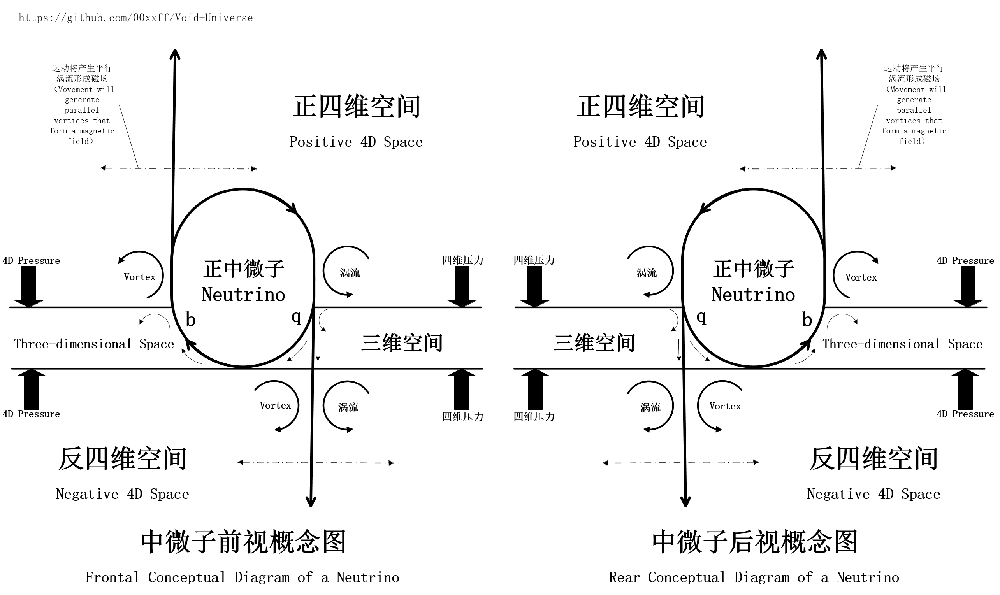
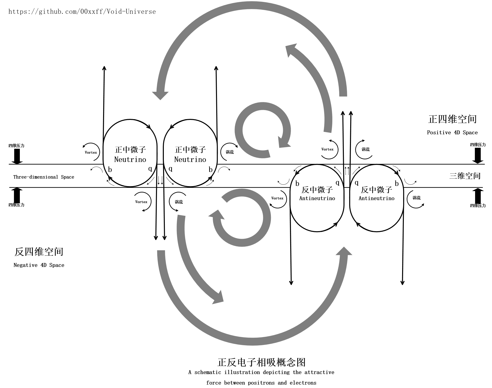
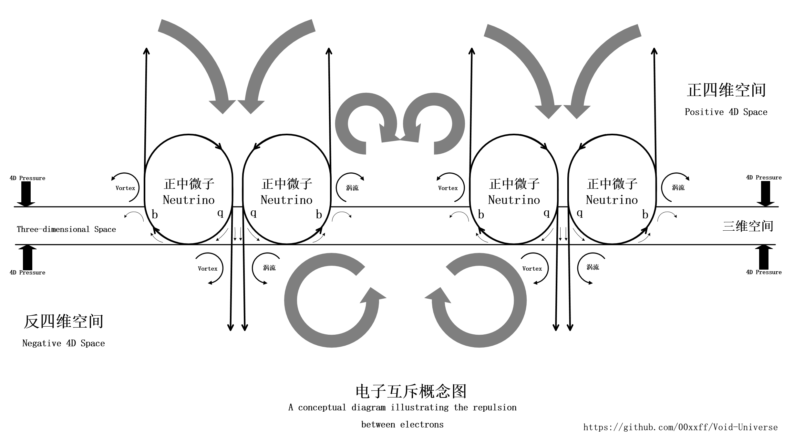
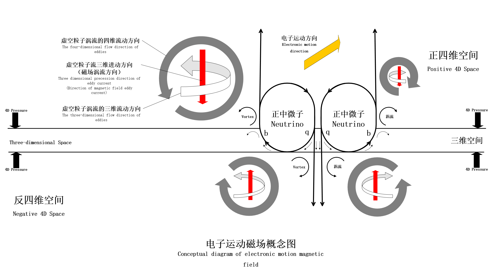
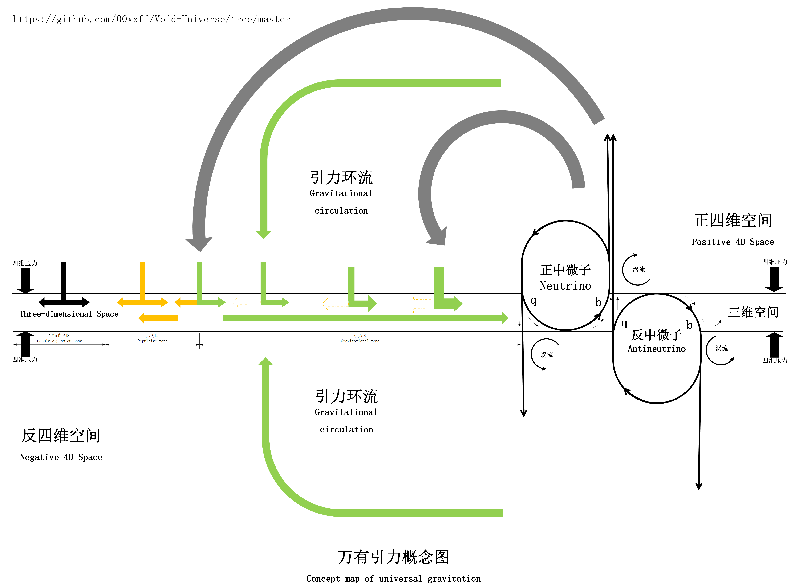

# 虚空宇宙假说

## 摘要

本文提出了一种全新的四维宇宙模型假说，描述了一个由两种基本粒子（A和B）构成的四维空间。在这一模型中，一个由四维矢量压力平衡形成的三维“膜”构成了我们所感知的三维宇宙。

该模型原理通俗易懂，通过将基本粒子基态的零点能、原子核的核能、宇宙膨胀的暗能量这些现有理论无法解释的巨大能量来源都归结到一种更基础的基本粒子上，并与另一种极小尺度的可以传递能量的基本粒子共同组成了一个可以用量子力学、热力学和流体力学描述的四维物理框架，在这个框架内，我们可以自然的解释许多之前难以理解的宏观及微观物理现象，包括但不限于以下内容：

- **微观层面**：中微子与电子的特性、基本粒子的构成、手性来源、正反物质的形成以及核能的来源。
- **天文学方面**：宇宙膨胀、暗物质、暗能量、星系动力学问题及宇宙大尺度结构的形成机制。
- **基本力的本质**：万有引力、电磁力、强相互作用和弱相互作用的形成过程及其作用机理。
- **量子力学现象**：量子隧穿效应、量子不确定性问题等。
- **光与电磁波**：光的产生、传播、偏振、波粒二象性，以及单缝和双缝实验的结果。
- **相对论效应**：狭义相对论和广义相对论中的时间膨胀、质量增加、引力透镜等现象。
- **其他现象**：黑洞视界与喷流的形成、引力波、量子纠缠时间、希格斯玻色子的质量来源、对称性破缺和宇称不守恒问题。

---

## 正文

### 1. 宇宙起源

在一个充满极小尺度 B 粒子的四维空间中，存在大量 A 粒子。这些 A 粒子表面具有永不停歇的光速循环波动。这种波动不仅驱动周围的 B 粒子形成瞬态涡流，还持续创造新的 B 粒子。由于 A 粒子不断注入能量，整个四维空间形成了一个相对稳定的空间背景压力。在这种背景压力以及 A 粒子周围涡流梯度压力的作用下，大量 A 粒子开始聚集，导致四维空间中出现不均衡的压力分布。

当 A 粒子聚集到一定规模时，两个 B 粒子压力集团的边界发生碰撞，在中间形成了一层四维矢量方向压力平衡的三维“膜”。这层“膜”就是我们所处的三维宇宙。

随后，大量 A 粒子与“膜”发生碰撞，并在双向压力的影响下依附在其两侧，逐渐聚集。由于 A 粒子的存在，“膜”的两侧产生了大量 B 粒子涡流，为“膜”的长期稳定提供了必要的压力和保护。同时，A 粒子还驱动大量 B 粒子流在“膜”两侧来回穿越，形成环流，最终构建了一个稳定的宇宙系统结构。

为了便于理解，我们在现有理论中找到与这两种粒子特性相近的概念，将A粒子的三维形态称为“中微子”，B粒子的三维形态称为“以太”。
在四维空间中，我们将它们的四维形态分别重新命名为“虚粒子”和“虚空粒子”。

- **虚空粒子（以太）**：具有一定的刚性和弹性，表现出空间不相容性，且尺度极小，可视为构成空间的基本单位。
- **虚粒子（中微子）**：表面具有永不休止的高频波动，是自然法则的根源之一。

需要注意的是，关于以太是否存在，将在后续章节（如迈克尔逊-莫雷实验分析）中进一步探讨。
虚粒子、虚空粒子的来源、虚粒子的永动特性，属于扩展部分-宇宙降维假说，虚粒子波动能量来自自身的其他维度，在此不展开描述。

本假说的三大基本设定包括：

1. 四维的“宇宙”；
2. 四维的“以太”；
3. 永动的“中微子”。

这些设定遵循简单性原则，仅针对标准模型和大爆炸理论无法解释的部分，不引入任何额外实体。

此外，“涡流”和“环流”是由流体速度梯度引起的局部压力差驱动的瞬态粒子流（以太流）。一旦失去压力差，这些流动将迅速消失。因此，虚粒子（中微子）永动的能量输出维持了整个四维空间的压力，符合能量守恒定律。

---

### 2. 基本粒子的形成

虚粒子（中微子）通过流体力学相互作用结合成更复杂的系统结构。中微子的四维形态是一个表面光速波动的类超球体，其三维形态则表现为表面光速波动的球体。其波动从四维经过三维再回到四维，因此在三维空间中可以观察到中微子的两极：一极是表面波带着粒子流凭空出现的位置，另一极是表面波带着粒子流凭空消失的位置。这种波动还会驱动周边的虚空粒子形成高速涡流，并伴随部分跨维度粒子流的出现与消失。

为了准确描述中微子的旋转方向和形态，我们将其中的一极定义为“ $b$ 极”，另一极定义为“ $q$ 极”：

* **$q$ 极** ：代表正反四维贯穿粒子流；
* **$b$ 极** ：代表三维流向四维的单向粒子流。

中微子在三维空间中的旋转方向是从 $q$ 极到 $b$ 极。

由于中微子的三维形态的半剖面形象类似一个高速旋转的齿轮，又是虚空压力以及所有物理现象的根源，同时还是宇宙形成的关键因素，我们将这个形态形象地称为“命运齿轮”，意为宇宙万物的命运所在。
通过对这个概念图的流体力学分析，可以推断 $q$ 极的贯穿流是粒子组合的核心所在。所有粒子稳定组合应至少包含一个 $q$ 极主导的贯穿流，而 $q$ 极的方向和数量决定了组成粒子的电荷类型和数量。
假设中微子的 $q$ 极代表 $-\frac{1}{3}e$ 电荷，反中微子的 $\bar{q}$ 极代表 $+\frac{1}{3}e$ 电荷。

基本粒子可以这样解释：

* **电子** ：由3个中微子组成，组合方式为 $qqq$，带 $-1e$ 电荷；
* **正电子（反电子）** ：由3个反中微子组成，组合方式为$\bar{q}\bar{q}\bar{q}$，带 $+1e$ 电荷；
* **上夸克** ：由6个中微子（4正2反）组成，组合方式为2正1反 $bb\bar{q}$ + 2正1反 $bb\bar{q}$，带 $+\frac{2}{3}e$ 电荷；
* **下夸克** ：由9个中微子（4正5反）组成，组合方式为2正1反 $bb\bar{q}$ + 1正2反 $\bar{b}\bar{b}q$ + 1正2反 $\bar{b}\bar{b}q$，带  $-\frac{1}{3}e$ 电荷。
* **质子**：对外表现为由2个上夸克和1个下夸克组成，推测应该还存在大量的等量  $bb\bar{q}$ 和 $\bar{b}\bar{b}q$ 中微子组成的正反夸克对。
* **中子**：对外表现为由1个上夸克和2个下夸克组成，推测应该是由大量的等量  $bb\bar{q}$ 和 $\bar{b}\bar{b}q$ 正反夸克对组成。
  （以上基本靠猜，如有雷同纯属巧合）

标准模型中粒子的自旋，在本模型中可以用四维虚空粒子环流对称性和方向来描述。
正反中微子因为其四维主体只存在于正/反四维空间的一侧，所以中微子表现出了手性特征，而由非对称的正反中微子组成的其他基本粒子自然也具备不同的手性特征。
中微子、电子由于仅由四维单侧的中微子组成，所以它们会处于一种高速的四维震荡状态，这使得它们在三维空间极其活跃，并且可以表现出隧穿现象（即凭空消失从四维空间移动绕过三维的势垒或障碍物然后再凭空出现）。
而其他重子则由正反中微子组成，所以它们会被牢牢锁定在三维“膜”上，并且这种结构如同黑洞一般不停的抽取三维空间中的虚空粒子注入四维空间，这也是万有引力得以形成的基础。

到这里，反物质也很好理解了吧，为什么核能如此巨大也很好理解了吧，为什么正反物质会湮灭并释放出大量光子也很好理解了吧。

### 3. 基本力的形成

* **电磁力** ：带电粒子的贯穿流导致的涡流梯度压力形成了静电力，带电粒子做三维运动产生的平行三维涡流被四维翻转因角动量守恒导致的三维垂直进动涡流形成了磁场；
  
  
  
* **强相互作用力** ：由粒子周边的三维涡流作用力形成；
* **弱相互作用力** ：由粒子周边的四维不稳态涡流作用形成；
* **万有引力** ：由三维空间的虚空压力梯度以及四维的虚空粒子引力环流共同作用形成。

由于正反四维空间的压力，无数的虚空粒子时刻都在侵入三维空间(三维"膜")中，形成均匀的三维扩张压力，这就是三维空间的虚空背景压力。
在质量系统附近，虚空粒子在四维空间中的密度分布呈超球体状，从中心向外逐渐减少；因此，在三维空间中围绕质量中心形成了由外向内递增的球形“增量”压力梯度。

三维空间中的物质主要由大量的 $ bbq $ 中微子复合结构组成，这些结构会不断抽取虚空粒子流入四维空间，从而在质量中心形成低压区。在三维虚空背景压力和增量压力的共同作用下，形成了由外至内的压力梯度和指向质量中心的虚空粒子流。这种跨四维和三维的超长程虚空粒子环流被称为“虚空粒子引力环流”。

我们将三维空间中这个球形的虚空粒子流动区域称为物质的虚空球引力区，而在虚空球引力区边界之外，虚空粒子增量压力逐步递减直至等于虚空背景压力，这个球形区域就是物质的虚空球，我们将物质虚空球边界到虚空球引力区边界之间的部分称为虚空球的斥力区。

当两个质量系统的虚空球引力区相互重叠时，就会产生局部压力差，在虚空背景压力的推动下，产生了引力现象。
而当一个较小的质量系统完全位于较大质量系统的虚空球引力区内部时，其受到的引力主要由该区域的虚空粒子流和虚空粒子增量压力形成的梯度压力共同决定。

当一个超大质量的系统处于主导地位时，其他小质量物体受到的引力主要源自该系统的虚空粒子引力环流产生的空间塌陷效应，即重力加速度，也就是在这个引力场范围无论物体质量大小、体积大小，其在相同位置的重力加速度是相同的，就是该位置的四维渗透粒子流速度（空间塌陷加速度），就如同帆船被横风吹动加速一样。但是这里不是因为引力产生了加速度，而是因为先有了加速度才产生了相应的力，即先有了加速度，然后才有了"引力"，这是因为在我们的认知当中，物体速度发生变化一定是受到了外力的作用，所以我们这个假想的“作用力”称为引力，根据牛顿第二定律 F=ma 计算就得到了万有引力。

图中引力环流内任意四维流向三维的虚空粒子流速与该位置的三维虚空粒子流速相同，等于该位置的引力加速度值。
我们可以做出这样一个推断，在星球/星系质量系统中任意一点的虚空粒子流速等于该点的引力加速度值，虚空粒子流方向等于引力加速度方向。
现在我们计算一下地球同步轨道与地球表面之间的引力红移量，将引力加速度值代入得到光在地球引力场虚空粒子流中传播的红移公式为 $\frac{\Delta \nu}{\nu} = -\frac{GM}{c^2} \left( \frac{1}{r_{\text{sync}}} - \frac{1}{R_E} \right)$ ，这与广义相对论的引力红移公式完全一致，或者说我们可以根据广义相对论的引力红移公式推导出地球引力场内任意一点的虚空粒子流速等于该点的重力加速度值。而当我们使用引力环流中虚空粒子流速来计算引力效应导致的时间延迟时，同样可以得到与广义相对论相同的时间延迟公式 $\Delta t_{\text{delay}} = \frac{GM}{c^2} \left( \frac{1}{R_E} - \frac{1}{r_{\text{sync}}} \right)$ ，所以由此可以表明虚空粒子引力环流模型完全可以作为广义相对论中时空弯曲效应的一种等效解释。

星系动力学问题也可以直接理解为星系旋转实际上是整个虚空粒子集团在旋转，即空间在旋转，与其中的星体质量无关，所以星系旋转形态只与空间旋转形态有关，所以不需要额外引入暗能量和暗物质来提供额外的“引力”。

宇宙星体之间的引力势能主要是由虚空压力梯度决定的，当两个大质量物体因万有引力相互吸引靠近，并获得动能时，物体因万有引力而获得的动能是由虚空压力提供的，与物体本身的能量无关，两个物体均未损失任何的能量，它们多出来的动能是由虚空压力提供的，也就是来自中微子的零点能。

---

### 4. 光与电磁波

在本模型中，光可以解释为三维膜上的界面波。三维膜两侧平衡的四维背景压力为界面波的形成和传播提供了均匀恒定的回复力。

由于光是三维膜上的界面波，所以光子的波峰和波谷都在四维空间，只有中间部分存在于三维膜中，因此从三维空间观察，光表现为一段段跳跃前进的光量子。光的传播速度由波的传播介质（即虚空粒子的密度）决定，因此是恒定的。

光和电磁波的生成并非连续单一的过程，而是由虚粒子与虚空粒子流相互作用在三维膜上产生的群体界面碰撞事件产生，这使得光和电磁波表现为离散的群体波，这种离散的性质使得单个光量子表现出粒子特性。同时，在产生光子的事件源头，事件发生的频率与光子波动的频率一致，这样就导致光子集群形成了与单个光子频率一致的概率波。因为光子集群与光子的速度相同，所以这个概率波的速度和波长也和光子相同。

综上所述：

- 单个光子既是一个四维界面波，又是一个在三维空间跳跃前进的量子团，这是光子的波粒二象性。
- 光是由大量光子组成的集群，这个光子集群在三维空间中的传播行为会表现出与单个光子的波长和频率一致的概率波，这是光在三维空间中的波粒二象性。
- 光的衍射和干涉实际上是由光的概率波导致的。由于光子同样具有波动性，单光子同样可以出现衍射现象，而多个单光子随机出现就会表现出概率波的特性。这也是单光子通过双缝依旧可以出现概率波的干涉图案的原因。
- 当在光路中施加影响对光子进行探测以确定其经过了哪条缝隙时，光子的概率波特性就会消失。这也是单光子双缝实验中，当光子被探测时，干涉图案消失的原因。
- 光子的波峰和波谷都在四维空间，与同在四维空间产生作用的电磁场可以相互影响是很正常的，这也合理地解释了光的偏振现象。

#### 物质波

同样的原理，物质波也很容易理解了，当电子在四维方向上振荡时，电子的行为在三维空间中就可以用波函数表示，这种振荡使得电子可以表现出与光子类似的波粒二象性。

#### 热力学本质

物体的温度反映了其内部所有粒子的四维波动强度（频率）。
热传导就是分子和原子通过静电力实现四维波动的共振和能量传递。
热辐射就是分子和原子的四维振荡在三维膜上产生界面波（如光、红外线、电磁波）。
热辐射升温机制就是当物体吸收光子的能量时，由于频率共振，其分子和原子的振荡频率增加，从而导致温度升高。

#### 光子的形态

光的偏振说明光子存在三维性状，即光子具备不同的波包形态。

光和电磁波并不是连续的线性波，而是一开始就是由离散的独立波包组成的独立波，光子的产生是源于三维膜界面处发生的高速(可能是超光速)碰撞事件，比如两个反向涡流的碰撞或命运齿轮的表面波与界面的碰撞，所以这个四维波的波包形态是由撞击事件的主体和撞击过程决定；
电磁波在虚空粒子中只能靠弹性(压缩和稀疏)传播，所以光子的能量波包就如同一团超光速的量子团在四维的两个压力层中来回反弹，这构成了光子在三维空间中的波函数表现；
撞击的速度越快，能量越大，超光速的量子团的速度也越快，反弹的频率也就越快，即光子的频率越高、波长越短；
所以在三维空间中，光子是一个按固定波长频率跳跃前进的曲面，可以是圆、椭圆、甚至是扁形或其他扭曲的形态，这个曲面仅仅是光子的四维波包在三维空间中的切面，这个切面上各个点的三维、四维动能矢量方向各不相同，在四维空间中就表现为磁场矢量和电场矢量。

光在真空中传播速度是恒定的，没有色散效应，当光在物质介质中（如空气、水、玻璃等）传播时，由于物质原子、分子周边的虚空粒子密度急剧变化，会导致色散效应，即波长越长的光子，越容易跨越原子、分子附近的高密度区，而显得速度更快，而波长越短的光，则会更多的陷入原子、分子附近的高密度陷阱中，速度就会显得更慢。

---

### 5. 相对论效应

* 在本模型中，整个宇宙都是动态平衡的三维"膜"，虚空无时无刻都在膨胀，所有的质量系统都是在相对运动中，四大基本力的形成机制与质量系统的整体惯性状态无关，所以物理定律在所有惯性系中都是相同的。
* 在本模型中，真空中的光速是一个常数，这是由真空中虚空粒子密度决定的，所以光速不变。而不同参考系中的光速测定，就涉及到一个测量方式的问题，假如我们在一个密闭的真空容器中测量光速(排除引力效应的影响)，那么我们在任何惯性参考系下测到的光速都是相同的。而我们常规意义上所指的惯性参考系，都符合这种密闭情形，比如在飞船的舱室里，比如在行星密闭的引力场环境中，在这些“封闭的”惯性参考系内部，光速只跟虚空粒子密度有关，跟整个参考系的惯性运动状态无关。
  以上两点满足狭义相对论中的狭义相对性原理和光速不变原理，所以本模型是兼容狭义相对论的（即可以推导出狭义相对论相关公式）。
  但是，本模型认为我们完全可以在不引入额外的时间维度的情况下，使用相对空间位移来推导出洛伦兹变换公式，时间只是推导过程的一个中间变量。

对于狭义相对论中根据时间变换推导出的一些特殊物理现象，我们可以做如下解释：
在本模型中，狭义相对论效应（时间膨胀、质量增加、长度收缩）主要适用于**微观粒子的高能实验结果**，而不是直接适用于宏观大质量系统。这些效应可以通过微观粒子核心处的虚粒子（命运齿轮）和虚空粒子流的动力学特性来解释。以下是对每种效应的具体分析：

#### **(1) 时间膨胀**

- **现象描述**：在高能实验中，不稳定粒子（如μ子）的寿命会随着速度的增加而延长。
- **机制解释**：
  - 在本模型中，时间膨胀的根本原因是**虚空粒子流密度的变化**对粒子系统稳定性的影响。
  - 当一个微观粒子以高速运动时，其核心处的命运齿轮会迎面撞上更多的虚空粒子，导致其周围的虚空粒子流密度显著增加。
  - 这种密度增加使得命运齿轮周围的虚空粒子涡流更加稳定，从而延缓了不稳定粒子结构的崩塌过程。换句话说，更高的虚空粒子密度提供了更强的外部压力，维持了粒子系统的平衡状态更长时间。
  - 因此，从外部观察者的角度来看，粒子的寿命延长，表现为时间膨胀。

#### **(2) 质量增加**

- **现象描述**：在高能实验中，微观粒子的质量会随着速度的增加而增大。当速度达到 $v = 0.866c$ 时，粒子的相对性质量约为静止质量的两倍。
- **机制解释**：
  - 在本模型中，质量的增加是由于**三维空间中的速度增加导致微观粒子核心多出一个额外的三维虚空粒子流**。
  - 具体来说，当一个微观粒子以高速运动时，其核心处的命运齿轮会迎面撞上更多的虚空粒子。这些虚空粒子在三维空间中形成一个新的环流系统，方向与粒子的运动方向一致。
  - 当粒子的速度达到 $v = 0.866c$ 时，这个新形成的三维虚空粒子流的速度等于命运齿轮原有的四维虚空粒子流速度。此时，粒子的核心处相当于多出了一个完整的虚空粒子环流系统，导致其总动量翻倍。
  - 根据本模型的定义，质量是与虚空粒子环流系统的总动量成正比的。因此，当速度达到 $v = 0.866c$ 时，粒子的质量增加了一倍。
  - 需要注意的是，这种质量增加仅适用于微观粒子，不能简单地推广到宏观大质量系统。

#### **(3) 长度收缩**

- **现象描述**：在高能实验中，微观粒子在运动方向上的有效碰撞截面会随着速度的增加而减小。
- **机制解释**：
  - 在本模型中，长度收缩的效应可以归因于**运动方向上的虚空粒子流影响范围被压缩**。
  - 当一个微观粒子以高速运动时，其核心处的命运齿轮在运动方向上会受到更强的虚空粒子冲击。这种冲击导致命运齿轮在运动方向上的虚空粒子流范围被压缩。
  - 这种压缩效应直接影响了粒子的碰撞截面，使其在运动方向上的有效尺寸变小。从实验观测的角度来看，这表现为长度收缩。
  - 同样，这种效应仅适用于微观粒子，不能直接应用于宏观物体。

#### **(4) 宏观大质量系统的特殊性**

- 在本模型中，狭义相对论效应（时间膨胀、质量增加、长度收缩）主要是针对**微观粒子高能实验结果**的解释，而不是普遍适用于所有物理系统。
- 对于**宏观大质量系统**，其内部由大量微观粒子组成，这些粒子之间的相互作用和整体结构可能屏蔽或削弱了单个粒子的相对论效应。因此，宏观大质量系统在高速运动时可能不会表现出与微观粒子相同的相对论效应。
- 例如：
  - 宏观物体的时间流逝是否受相对论效应影响，取决于其内部微观粒子的平均行为以及整体系统的动力学特性。
  - 宏观物体的质量变化和长度收缩可能需要更复杂的分析，尤其是涉及引力场和虚空球的动态影响。

#### **(5) 与广义相对论的关系**

- 广义相对论中的时间膨胀和引力红移现象可以通过虚空粒子的流动和密度变化来解释：
  - 在强引力场中，虚空粒子的密度显著增加，导致命运齿轮周围的虚空粒子涡流更加稳定，从而延长了不稳定粒子的寿命（时间膨胀）。
  - 引力场中的光路偏折和黑洞视界现象则与虚空粒子流的方向和速度分布密切相关。
  - 使用引力加速度值推导出的虚空粒子流红移公式与广义相对论的引力红移公式一致，说明在非极端情况下引力红移现象可以直接用虚空粒子引力环流来解释。

#### **(6) 质量-能量等价**

在本模型中，质量和能量的本质都可以归结为虚粒子和虚空粒子流的动量分布。根据爱因斯坦的质能方程 $E = mc^2$，质量可以视为一种高度浓缩的能量形式。在本模型中，这一关系可以通过虚粒子的高频波动和其驱动的虚空粒子环流来解释：虚粒子的波动能量直接转化为虚空粒子流的动能，进而表现为质量或能量。

#### **总结**

在本模型中，狭义相对论效应（时间膨胀、质量增加、长度收缩）主要适用于**微观粒子的高能实验结果**，其根本原因在于：

1. **时间膨胀**：虚空粒子流密度增加，延长了不稳定粒子的寿命。
2. **质量增加**：三维空间中的速度增加导致核心处多出一个三维虚空粒子流，当速度达到 $v = 0.866c$ 时，质量增加一倍。
3. **长度收缩**：运动方向上的虚空粒子流范围被压缩，导致碰撞截面变小。

这些效应不能简单地推广到宏观大质量系统，因为宏观系统的复杂性和整体动力学特性可能会屏蔽或削弱单个粒子的相对论效应。

---

### 6. 迈克尔逊-莫雷实验

#### **1. 背景与传统解释**

迈克尔逊-莫雷实验旨在检测“以太风”的存在，即光波传播介质相对于地球的运动。然而，实验结果表明，无论地球的运动状态如何，光速在不同方向上始终保持恒定。这一结果否定了经典以太假说，并为狭义相对论的提出奠定了基础。

然而，在本模型中，“以太”被重新定义为**虚空粒子**，这是光和电磁波的传播介质。虚空粒子具有动态流动特性，其行为受到引力场的影响。因此，我们需要结合地球引力场内虚空粒子流的特性，重新分析迈克尔逊-莫雷实验的结果。

#### **2. 地球引力场中的虚空粒子流特性**

根据本模型中对万有引力本质的推导：

- 在地球引力场内，虚空粒子从外部空间流向地心，形成一个球形的虚空粒子流(引力环流的三维空间部分)。
- 引力场中任意一点的虚空粒子流速度值等于该点的重力加速度值，方向指向地心。
  - 例如，在地球表面，虚空粒子流的速度约为 $g = 9.8 \, \text{m/s}$，方向垂直向下。
- 这种虚空粒子流是由四维空间向三维空间侵入的引力环流驱动的，并且在整个引力场范围内均匀分布。

因此，在地球表面附近，虚空粒子流的主要特征是：

1. **方向性**：虚空粒子流的方向始终指向地心，而不是随地球的公转或自转而改变。
2. **速度值**：虚空粒子流的速度较低（约 $9.8 \, \text{m/s}$），远小于光速（$c \approx 3 \times 10^8 \, \text{m/s}$）。
3. **相对静止性**：由于虚空粒子流与地球引力场同步旋转，地球表面附近的虚空粒子流在其他方向上与地球保持相对静止。

#### **3. 迈克尔逊-莫雷实验的重新分析**

基于上述特性，我们可以重新分析迈克尔逊-莫雷实验的结果。

##### **(1) 实验设计与预期**

迈克尔逊-莫雷实验的核心假设是：如果存在“以太风”，则光在不同方向上的传播速度会因地球相对于“以太”的运动而发生变化。实验通过干涉仪测量两束光的相位差，试图检测这种速度差异。

在传统以太假说中，“以太”被视为一种刚性、静态的介质，地球在其内部运动时会产生“以太风”。然而，在本模型中：

- 虚空粒子流的方向始终指向地心，而非随地球公转或自转而变化。
- 垂直方向的虚空粒子流的速度极低（约 $9.8 \, \text{m/s}$），远小于光速，因此对光速的影响可以忽略不计。
- 地球表面附近其他方向的虚空粒子流与地球保持相对静止，这意味着地球表面不存在显著的“以太风”。

##### **(2) 实验结果的解释**

根据本模型理论，迈克尔逊-莫雷实验未能检测到“以太风”的原因如下：

1. **虚空粒子流的低速特性**：

   - 在地球表面，虚空粒子流的速度仅为 $9.8 \, \text{m/s}$，这与光速相比微不足道，因此对光的相位影响可以忽略，远远低于迈克尔逊-莫雷实验的实验精度。
   - 光的传播速度主要由虚空粒子的密度决定，而虚空粒子的密度在地球表面相对均匀，导致光速在不同方向上保持恒定。
2. **虚空粒子流的相对静止性**：

   - 地球表面附近的虚空粒子流与地球同步旋转，因此在地球参考系内，虚空粒子流表现为相对静止。
   - 这意味着地球表面不存在显著的“以太风”，从而解释了迈克尔逊-莫雷实验中未观察到干涉条纹变化的现象。
3. **引力场的屏蔽效应**：

   - 地球引力场内的虚空粒子流形成了一个稳定的球形结构，屏蔽了外部虚空粒子流的扰动。
   - 因此，地球表面的虚空粒子流不会受到地球公转或太阳系运动的影响，进一步保证了光速的各向同性。

##### **(3) 实验局限性**

迈克尔逊-莫雷实验的设计基于以下假设：

- “以太”是一种刚性、静态的介质。
- 地球相对于“以太”的运动会产生显著的“以太风”。

然而，在本模型中：

- 虚空粒子是动态的、非刚性的介质(有密度变化)。
- 地球表面附近垂直方向的虚空粒子流速度极低，且其他方向与地球自转保持相对静止。

因此，迈克尔逊-莫雷实验实际上并未否定光需要介质传播的假设，而只是否定了静止“以太”的假设。

#### **4. 结论**

在本模型中，迈克尔逊-莫雷实验未能检测到“以太风”的原因可以归结为以下几点：

1. 地球引力场内垂直方向的虚空粒子流速度极低（约 $9.8 \, \text{m/s}$），远远低于迈克尔逊-莫雷实验的实验精度。
2. 地球表面附近其他方向的虚空粒子与地球保持相对静止，导致地球参考系内不存在显著的“以太风”。
3. 地球引力场屏蔽了外部虚空粒子流的扰动，确保了光速的各向同性。

---

### 7. 其他物理现象的解释和推测

#### 黑洞视界与喷流的形成

黑洞的引力场极强，导致其周围的虚空粒子流速度接近甚至超过光速。在这种极端条件下，黑洞中心形成了一个超光速的虚空粒子漩涡，阻止了光子从黑洞内部逃逸，从而形成了黑洞视界。

然而，在黑洞的两极区域，由于旋转效应，可能会形成低速旋涡区。这些区域的虚空粒子流速度较低，允许部分高能射线从中逃逸，形成黑洞喷流。

#### 引力波

引力波是由大质量天体（如双黑洞系统）的高速运动引起的三维空间中的虚空粒子压缩波。当两个大质量天体相互绕转并最终合并时，它们周围的虚空粒子流会发生剧烈扰动，产生压缩界面波并以光速向外传播。引力波的探测验证了本模型中虚空粒子作为传播介质的假设。

#### 量子纠缠时间

量子纠缠现象可以通过虚粒子的高频波动和四维虚空粒子流的瞬态作用来解释。最新的实验数据表明量子纠缠建立的时间约为 $232 \, \text{as}$，在本模型中，这一数值与电子核心射出的虚空粒子流通过氦原子直径所需的时间（约 $240 \, \text{as}$）高度一致。这表明量子纠缠可能依赖于虚粒子和虚空粒子流的瞬态动力学过程。

#### 希格斯玻色子的质量来源

希格斯玻色子的质量可以通过虚粒子的高频波动和其驱动的虚空粒子环流来解释。虚粒子的波动能量直接转化为虚空粒子流的动能，进而赋予基本粒子质量。这一机制与标准模型中的希格斯机制一致，但在本模型中提供了更直观的物理图像。高能物理实验中观测到的希格斯玻色子可能只是一团高能瞬时虚空粒子涡流。希格斯玻色子的寿命约为 $160 \, \text{as}$ ，这也符合虚空粒子瞬态涡流平复的时间尺度。

#### 对称性破缺和宇称不守恒

在本模型中，对称性破缺和宇称不守恒问题可以通过虚粒子(中微子)的手性和其驱动的虚空粒子流的方向性来解释。虚粒子(中微子)的四维极性(正反)决定了其手性，而手性特征进一步影响了由虚粒子组成的复合粒子的行为。例如，弱相互作用中的宇称不守恒现象可以归因于虚粒子的非对称性涡流结构。

#### 宇宙膨胀与暗能量

宇宙膨胀的根本原因在于虚空粒子的数量的持续增加以及虚粒子光速波动的持续能量输出，导致整个四维空间的压力梯度不断变化。这种压力梯度的变化推动了三维膜的扩张，表现为宇宙膨胀。暗能量则可以视为虚空粒子四维渗透扩张压力的宏观表现，其来源可以用虚粒子的永动特性来解释。

#### 暗物质

暗物质现象可以通过虚空球的特性来解释。星系和星系团的旋转曲线问题表明，除了可见物质外，还存在一种不可见的物质成分提供额外的引力。在本模型中，万有引力是由虚空压力梯度和四维引力环流共同作用形成的，所以星系动力学问题实际上是虚空粒子的流体力学问题，是三维空间背景压力与星系自身的四维空间压力梯度共同作用的结果，与其中的星体质量并不直接相关，因此不需要引入额外的质量来提供额外的引力。
